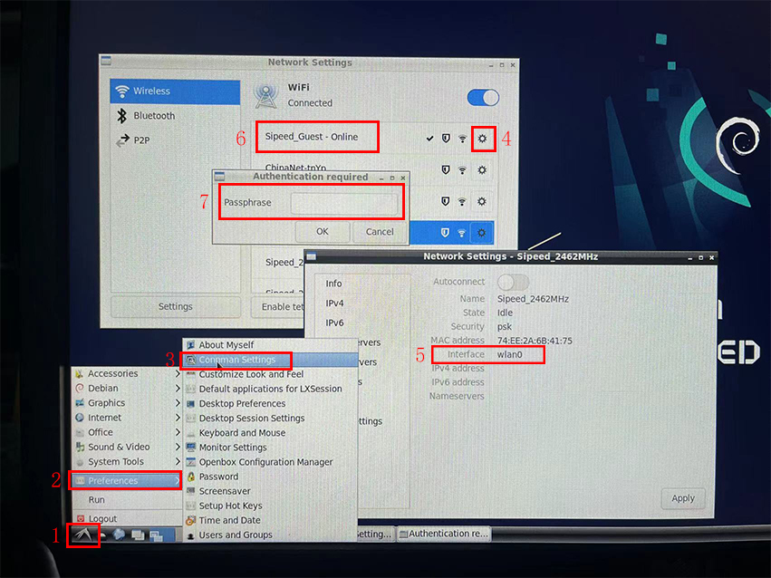
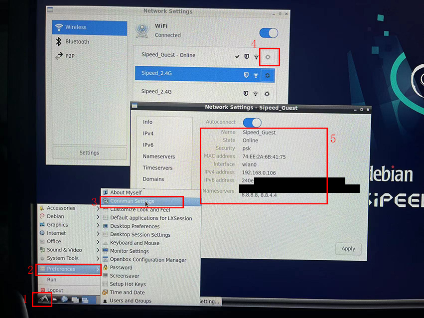

# Start

> Edit on 2022.04.21

Note:
If you use debian, it will take about 2 minutes (this depends on the tf card) to start system.
Then using command `Alt+F2` In graphical interface, then input `termit` to open the terminal.
Do the following steps to stop kernel continue printing message when you use serial port or remote connection

- Login in system,the user name is `sipeed` and the password is `licheepi`
- Edit `/etc/rsyslog.conf` by root and change `*.emerg` into `#*.emerg` in this file
- restart rsyslog service by this command `/etc/init.d/rsyslog restart`
  
Then you can use this system with pleasure.


## Blink

We can start blink an led after running OS.
- Note : This blink turtial is not fit for  `86-panel` because the corresponding pin in `86-panel` is connected to the peripheral, you can use the core board to do this experiment.  

There is an LED beside the screw fixing pad on the core board, This can be found in this file:
https://dl.sipeed.com/shareURL/LICHEE/D1/Lichee_RV/HDK/5_Dimensions

And from the [schematic]{https://dl.sipeed.com/shareURL/LICHEE/D1/Lichee_RV/HDK/2_Schematic} we can know the led connects with PC1 pin, and we can figure out its siginal number is 2*32+1=65. We can also view IO multiplexing table

```bash
cat /sys/kernel/debug/pinctrl/2000000.pinctrl/pinmux-pins
...
pin 64 (PC0): device 2008000.ledc function ledc group PC0
pin 65 (PC1): UNCLAIMED
pin 66 (PC2): UNCLAIMED
pin 67 (PC3): UNCLAIMED
pin 68 (PC4): UNCLAIMED
pin 69 (PC5): UNCLAIMED
pin 70 (PC6): UNCLAIMED
pin 71 (PC7): UNCLAIMED

```

First we should figure out this led GPIO：

```
echo 65 > /sys/class/gpio/export
cd /sys/class/gpio/gpio65
```

Then we change this IO into output mode，which means control its voltage level ：

```
echo out>direction
echo 1 > value  #LED ON
echo 0 > value  #LED OFF
```

Up to now we have succeeded blinking on RISC-V 64 D1.

You can also perform fancy lighting on the serial RGB LED ws2812:

```
cd /sys/class/leds/
echo 255 > /sys/class/leds/sunxi_led0r/brightness;echo 0 > /sys/class/leds/sunxi_led0g/brightness;echo 0 > /sys/class/leds/sunxi_led0b/brightness;
echo 0 > /sys/class/leds/sunxi_led0r/brightness;echo 255 > /sys/class/leds/sunxi_led0g/brightness;echo 0 > /sys/class/leds/sunxi_led0b/brightness;
echo 0 > /sys/class/leds/sunxi_led0r/brightness;echo 0 > /sys/class/leds/sunxi_led0g/brightness;echo 255 > /sys/class/leds/sunxi_led0b/brightness;
```

## Peripheral verification

> Note:In the current Debian system, bluetooth is unavailable！！

### Audio

Check Audio device

```
root@MaixLinux:~# arecord -l
**** List of CAPTURE Hardware Devices ****
card 0: audiocodec [audiocodec], device 0: SUNXI-CODEC 2030000.codec-0 []
  Subdevices: 1/1
  Subdevice 0: subdevice 0
card 1: snddmic [snddmic], device 0: 2031000.dmic-dmic-hifi dmic-hifi-0 []
  Subdevices: 1/1
  Subdevice 0: subdevice 0
card 2: sndhdmi [sndhdmi], device 0: 2034000.daudio-audiohdmi-dai 20340a4.hdmiaudio-0 []
  Subdevices: 1/1
  Subdevice 0: subdevice 0

```

Check play device

```
root@MaixLinux:~# aplay -l
**** List of PLAYBACK Hardware Devices ****
card 0: audiocodec [audiocodec], device 0: SUNXI-CODEC 2030000.codec-0 []
  Subdevices: 1/1
  Subdevice 0: subdevice 0
card 2: sndhdmi [sndhdmi], device 0: 2034000.daudio-audiohdmi-dai 20340a4.hdmiaudio-0 []
  Subdevices: 1/1
  Subdevice 0: subdevice 0

```

Recording and playback test:

```
arecord -D hw:1,0 -f S16_LE -t wav -d 3 t.wav 
aplay -D hw:0,0 t.wav
```

Besides, you can Adjust volume by alsamixer application

### USB Function

Default kernel supports the driver of external USB flash disk. After inserting the USB flash disk, you can use `fdisk -l` command to see the new /dev/sda device

If the USB flash disk is not formatted, you can use mkfs.vfat command to format the USB disk, and then mount it.

The /dev/mmcblk0p8 partition in the default Tina firmware can be mounted after formatting USB disk in the above way to increase the available space

### Wired network

LicheeRV-86 Panel supports 100M network.

After Inserting network cable we can use following commands to connect network

```
ifconfig eth0 up
udhcpc -ieth0
```

### Wireless network

- **Tina OS**

We can connect the core board by TypeC port and use adb to control this OS, or use uart to connct this board is ok too.
  
  LicheeRV bottom board is equipped with XR829 or RTL8723BS wifi module, can connect network by following commands:

  Config wifi information:

  ```bash
  vim /etc/wifi/wpa_supplicant.conf
  network={  
      ssid="WiFi_name"  
      psk="WiFi_password"  
  } 
  ```

  Then restart board, use these two commands `ifconfig wlan0 up`; `udhcpc -iwlan0`  to connect corresponding wifi.
  Then we can use ssh to remote login or use scp to transfer files by network.

- **debian OS**


  Click System menu -> Preferenes -> Connman Settings，Enable Network Settings ，check whether the interface in the network property is wlan0. Double click the network name and input WiFi password to connect wifi.

  

  After succeeding connecting network, we can see the network IP

  

### Display and touch

LicheeRV supports following screen：

- SPI screen		  1.14 inch(TODO)
- RGB screen		  4.3 inch 480x272；5.0 inch 800x480；
- RGB+SPI screen  4.0 inch 480x480(st7701s); 4.0 inch 720x720(nv3052c)
- MIPI screen   	8.0 inch 1280x720(ILI9881C)


We can use following command to test screen in **Tina OS** 下可以通过以下指令测试屏幕显示：

```bash
  fbviewer xxx.jpg
```

If you need to debug screen driver, just use following command to see information of screen driver

```
cat /sys/class/disp/disp/attr/sys

screen 0:
de_rate 300000000 hz, ref_fps:60
mgr0: 480x480 fmt[rgb] cs[0x204] range[full] eotf[0x4] bits[8bits] err[0] force_sync[0] unblank direct_show[false] iommu[1]
dmabuf: cache[0] cache max[0] umap skip[0] overflow[0]
	lcd output	backlight( 50)	fps:59.5	esd level(0)	freq(60)	pos(0)	reset(0)	 480x 480
	err:0	skip:184	irq:230715	vsync:0	vsync_skip:0
   BUF    enable ch[1] lyr[0] z[16] prem[N] a[globl 255] fmt[  0] fb[ 480, 480; 480, 480; 480, 480] crop[   0,   0, 480, 480] frame[   0,   0, 480, 480] addr[ffe00000,       0,       0] flags[0x       0] trd[0,0]

```

Screen Color Bar test：echo 1 > /sys/class/disp/disp/attr/colorbar

If you buy 86 panel suit, you can use `ts_test` for touching test

> There is a bug on touching driver, that is, After the test, the cursor do not move, but the terminal will still print information

### Play video

Now we can play BadApple On licheeRV [Click me to download video](https://dl.sipeed.com/shareURL/LICHEE/D1/Lichee_RV/MP4)

FFmpeg has been built in Tina image, which is a powerful multimedia library, can be used for screen recording or play video

Recording command：`ffmpeg -f fbdev -framerate 10 -i /dev/fb0 record.avi`

Play commamd (They are play audio from speaker and HDMI)

```
ffmpeg -i /mnt/UDISK/badapple_640480_xvid.mp4 -pix_fmt bgra -f fbdev /dev/fb0 -f alsa hw:0,0  ## speaker
ffmpeg -i /mnt/UDISK/badapple_640480_xvid.mp4 -pix_fmt bgra -f fbdev /dev/fb0 -f alsa hw:2,0  ## hdmi 
```

Because of it's software decoding by cpu, so the test of screen resolution supports 750x540 Maximum, and it will run slower if play higher screen resolution.

<iframe src="https://player.bilibili.com/player.html?aid=209723771&bvid=BV1xa411r7PP&cid=457742249&page=1" scrolling="no" border="0" frameborder="no" framespacing="0" allowfullscreen="true"> </iframe>

### Microphone array

If you use Dock board, you can use microphone array to perform sound field imaging display:

Run `sudo ./micarr_0609` in terminal.

If you need redevelop about microphone array, just contact support@sipeed.com

<iframe src="https://player.bilibili.com/player.html?aid=849734125&bvid=BV1HL4y1H7nv&cid=457750392&page=1" scrolling="no" border="0" frameborder="no" framespacing="0" allowfullscreen="true"> </iframe>

## Debian image experience

For people who only have used desktop system, it's suggested to use debian.
And it can be download form [netdisk]()

LicheeRV_Debian_86_480p is 480p 86 panel debian image.

LicheeRV_Debian_hdmi is debian image for dock hdmi output

Other board or screen, use corresponding fex file to reconfig.

After burning system, insert card, wait about 2 minutes then the screen will display


Username `sipeed` and password `licheepi`. Need extra mouse and keyboard.


Using `Alt+F2` then input termit to open terminal.

Then we can de some basic operations.


Let's try to compile and run hello world


We also provide 720P 720p high-definition screen, you can try this if you have enough money~


## BSP SDK develpoment

To make it easy for users to develop custom function, Sipeed provide bsp docker image of LicheeRV.

Download link:[Mege netdisk](https://mega.nz/folder/lx4CyZBA#PiFhY7oSVQ3gp2ZZ_AnwYA)

After finishing downloading docker file, decompress into tar file.

```bash
gzip -d licheerv_d1_compile.tar.gz                                #Decompress into tar file
docker import licheerv_d1_compile.tar licheerv_d1_compile:latest  #import docker image
```

After succeed running it's suggessted to relogin and username `nihao` password `sipeed123`

```bash
sudo docker run -it licheerv_d1_compile:latest /bin/bash # Start D1 compile docker image in interactive mode
login # change user
```

You can use following commands to finish compiling.

```bash
cd ~/sdk/tina-d1-open_new/
source build/envsetup.sh
lunch   # choose 1
make menuconfig  # untick alsa-plugin, otherwise it will fail to compile
make -j8  
pack  
```

There are some new dts file in this SDK, you can use them if necessary
Ther are in device/config/chips/d1/configs/nezha/board_xxx.dts

Other SDK developing manual can refer to relevant documents on the Allwinner development platform
https://open.allwinnertech.com/

If you need other SDK please visit allwinner official website: https://d1.docs.aw-ol.com/en

## WAFT developer's guide

TODO