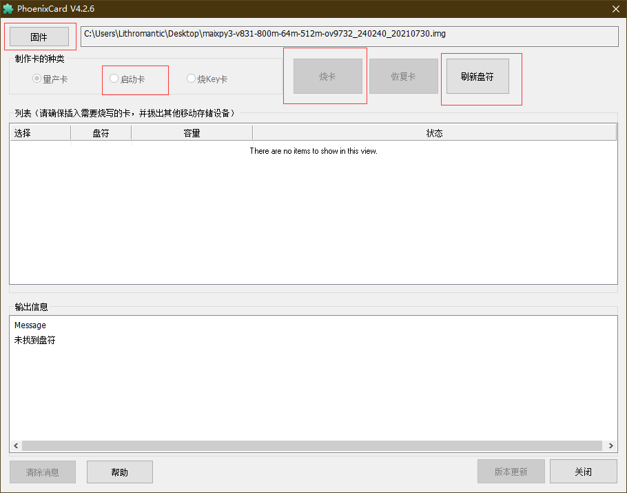
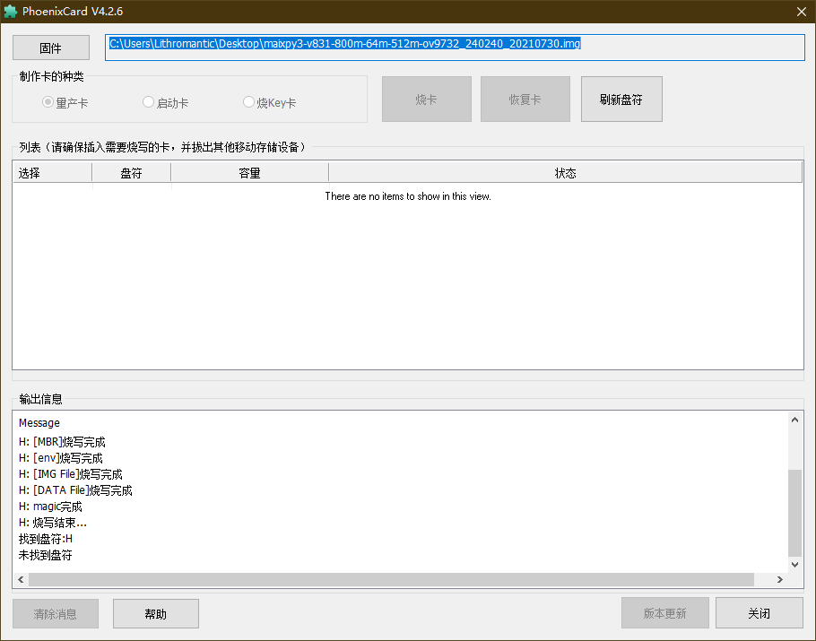

| 文档更新时间 | 负责人 | 更新内容 |
| :---: | :---: | :---: |
| 2021.03.20 | 大老鼠 | 新建文档，开始编写内容 |
| 2021.12.8 | Ray & 点灯鼠 | 整理并更新烧录方式 |

> 不同的内存卡存在差异，不是官方店铺购买的内存卡不能保准可以烧录系统，每个人的烧录环境存在差异，推荐小白直接购买官方的镜像卡。

## 获取镜像文件

从下载站获取最新的 V831 系统镜像 [SDK_MaixII/release](https://dl.sipeed.com/shareURL/MaixII/MaixII-Dock/SDK/release) ,得到一个压缩包，解压之后就得到一个 .img 文件，这个就是系统镜像文件

> 如果下载站下载的很慢，建议使用百度网盘进行下载，下载站的下载带宽有限。链接：<https://pan.baidu.com/s/10qU9BUL8NE07ILexc5EZhw> 提取码：2333 

### 镜像文件命名方式

对于V831的镜像文件名字是有对应的规则，以后大家可以根据自己的需求来进行下载

就拿`maixpy3-0.3.4_MaixII-Dock_20211119.7z`这镜像文件来说

| 名称 | 含义 |
| --- | --- |
| maixpy3-0.3.4 | 此镜像是给 MaixPy3 专用，并内置了`0.3.4`的版本 |
| MaixII-Dock | 可使用 MaixII-Dock 开发板平台 |
| 20211119 | 镜像更新日期 |

## Windows 上使用 PhoenixCard烧录镜像

PhoenixSuit和PhoenixCard是全志芯片常用的两种烧录工具，一个是USB烧录，另一个是sd卡烧录。对于需要烧录到flash中的，常用PhoenixSuit，而使用sd卡的在用PhoenixSuit需要安装USB驱动等一系列的麻烦操作，就可以使用PhoenixCard进行烧录。

### 准备工作

1. 烧录工具 [PhoenixCard](https://dl.sipeed.com/shareURL/MaixII/MaixII-Dock/SDK/tools)

2. 系统 [镜像](https://dl.sipeed.com/shareURL/MaixII/MaixII-Dock/SDK/release)

3. 内存卡格式化工具 [SD Card Formatter](https://www.sdcard.org/downloads/formatter/eula_windows/SDCardFormatterv5_WinEN.zip)

### 系统烧录

1. 将内存卡通过读卡器接到电脑的 USB 口，打开 SD Card Formatter 软件，对内存卡进行格式化。Refresh后点击Format后格式化，注意选中对应的sd卡。

     

2. 打开PhoenixCard,固件处选择对应镜像包（下载镜像后需要先解压），然后刷新盘符，如果未找到可以尝试重新插拔下SD卡，勾选启动卡，点击烧卡。

     

     大概30s后，烧录完成。
     

## Linux(Ubuntu) 使用 Livesuit 烧录

### 安装烧录工具 Livesuit 

> **每次更新系统 linux kernel 之后需要重新安装软件**

1. 安装依赖 dkms

     ```shell
     sudo apt install dkms
     ```

1. 安装 libpng1.2（一定要使用这个版本）

     ```shell
     wget http://archive.ubuntu.com/ubuntu/pool/main/libp/libpng/libpng_1.2.54.orig.tar.xz
     tar xvf  libpng_1.2.54.orig.tar.xz
     ```

     ```shell
     cd libpng-1.2.54
     ./autogen.sh
     ./configure
     make -j8
     sudo make install
     ```

     更新链接库:

     ```shell
     sudo ldconfig
     ```

1. 安装 **livesuit**

     ```shell
     git clone --recursive https://github.com/QinYUN575/allwinner-livesuit.git
     cd allwinner-livesuit
     chmod +x livesuit_installer.run
     sudo ./livesuit_installer.run
     ```


### 使用 Livesuit 烧录

`sudo livesuit` 打开烧录工具，并点击“固件”选择镜像文件


不插入 SD 卡，将 V831 USB OTG 接口连接到 PC, 提示是否格式化分区，这时候插入 SD 卡，之后点击 `YES`


等待烧录完成，提示“固件升级成功”，即可断开 USB ，至此固件烧录完毕


## 附录
### 无 SD/TF 卡烧录方式

[烧录方式](./no_sd_flash.md)

### 无读卡器烧录方式

[烧录方式](./PhoenixSuit.md)

### 使用 dd 烧录

官方没有做 MaixII-Dock 的 dd 镜像相关支持，有需要的可以自行去学习如何制作 dd 镜像的[制作](https://www.cnblogs.com/USTHzhanglu/p/15431249.html)。

