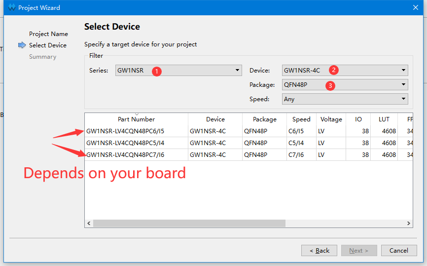
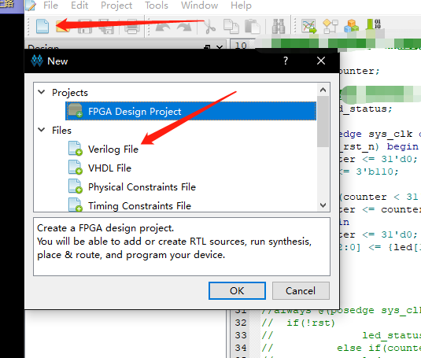
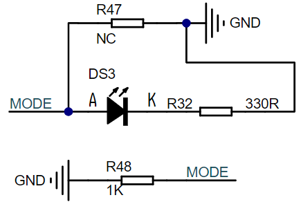
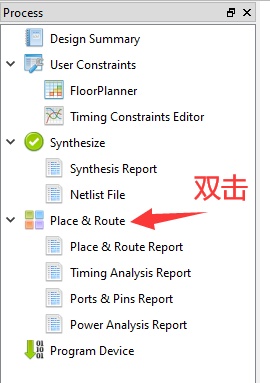
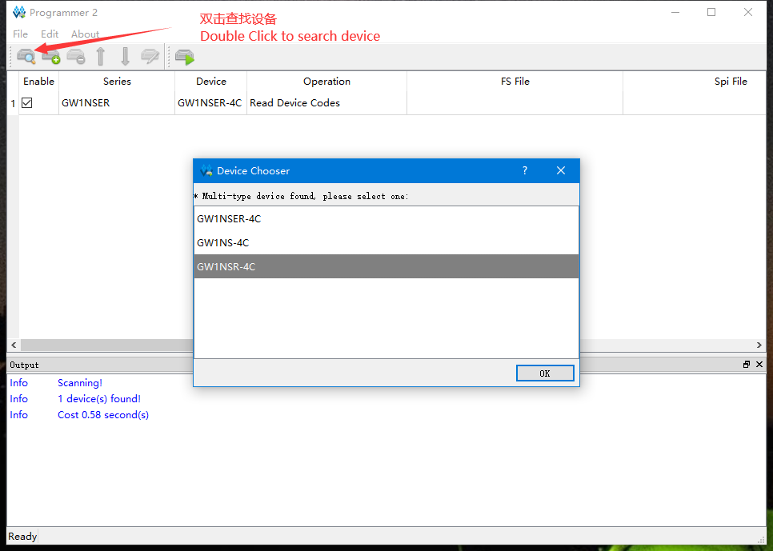
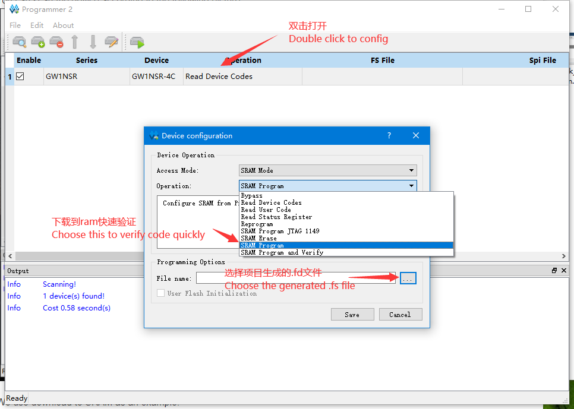

> Edit on 2022.04.15

From this essay we can learn the basic usage of Gowin IDE

## Create Project


Create Project：File-->NEW-->FPGA Dsign Project-->OK


Set project name and project path (File name and project path shoule be English)


Choose correct device: 


- The main chip model on some boards is C7/I6, please pay attention to this and choose correct model.

## Prepare codes

After creating project, we can start editing codes. 
To creat a new file, we can click where the arrow points to in the picture or use shortcut key Ctrl+N.
Then choose Verilog File in the pop-up window.


Name for file (Suggested using English)


Double click the created file, then edit in right window


- We use light led as an example, copy the following "LED example codes" into the created file or edit the created file by yourself.  

```verilog
module led (
    input   sys_clk,
    input   sys_rst_n,     // reset input
    output  reg led        // LED
);

reg [23:0] counter;        //定义一个变量来计数

always @(posedge sys_clk or negedge sys_rst_n) begin // Counter block
    if (!sys_rst_n)
        counter <= 24'd0;
    else if (counter < 24'd1349_9999)       // 0.5s delay
        counter <= counter + 1;
    else
        counter <= 24'd0;
end

always @(posedge sys_clk or negedge sys_rst_n) begin // Toggle LED
    if (!sys_rst_n)
        led <= 1'b1;
    else if (counter == 24'd1349_9999)       // 0.5s delay
        led <= ~led;                         // ToggleLED
end

endmodule

```

After finishing edit the file, it's necessary to tick the `Use DONE as regular IO` in Project->Configuration->Place&Route->Dual-Purpose Pin to avoid error.


## Systhesize, constrain, place&route

### Systhesize

After finishing steps above, go to the "Process" interface, systhesize the edited file, which means running "Systhesize". 


If the result is the same as shown below
 

It means that there is no bug in our code, we can continue the next steps. 

If there is some thing wrong, please fix by yourself. 

### Constrain

- Clock constraint is not involved here

To realize function of the code on FPGA, we need bind the ports we define with the chip pins.

Double click the FloorPlanner in the Process interface to set pin constrain(This can be continued if failing systhesize). 


First time open FloorPlanner it will notice lack ".cst" file, we just choose ok. 


The leds schematic of nano 9k is as shown below:


| port      | I/O    | pin | desc       |
| --------- | ------ | --- | ---------- |
| sys_clk   | input  | 45  | Clock input|
| sys_rst_n | input  | 15  | System_reset |
| led       | output | 10  | LED       |

In this GUI interface we have two ways to constrain pins:
- Drag the corresponding port to the pin of chip
- Type the pin number corresponding to the port in IO constraint

So we can choose one way in the opened window as what the following picture shows to finish constrain:


### Place&Route

> If it shows error 2017, the solve way can be found ahead(Tips: Enable Dual-Purpose Pin) 

After finishing Running "Place&Route" in the Process interface window, the result will be as same as below


## Program

Then connect the board with computer, download firmware.

You can scan the device according to the following picture.


We use download to SRAM as an example.
- Configure download mode



Then we just click download to start program device.

Then the led on the board will blink

If you need to store firmware with no power, just choose download to flash mode.

## End

Now the tutorial ends, if you have any suggestions, just leave a message.