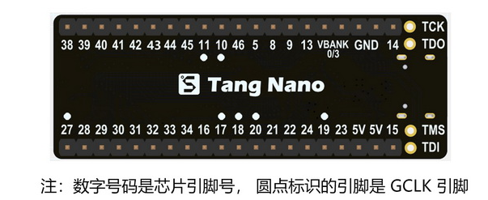
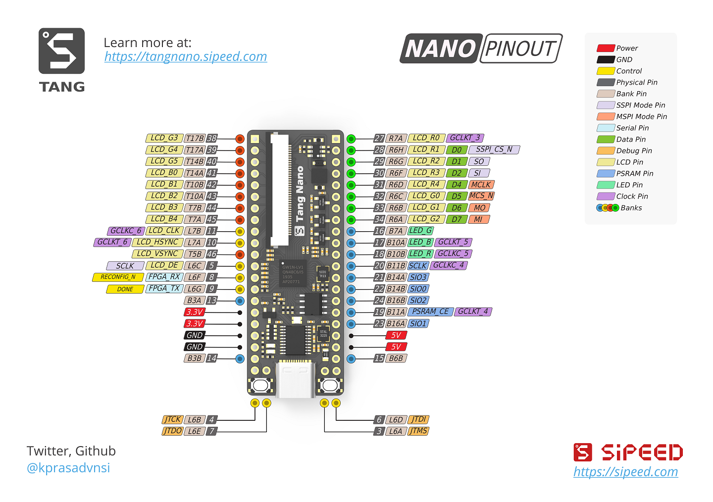

# Tang Nano

> Edit on 2022.03.23

## Summary

Lichee Tang Nano is a simple development board based on the GW1N-1 fpga chip which belongs to the Gowin little bee series. The development board is Small and delicate, and all resources of the chip are pulled out. There are Type-C interface, RGB Interface(this can be used to connect peripherals like LCD screen or VGB interface), PSRAM and Onboard USB-JTAG on this development board. All IO resources are pulled out, which is convenient for developers to use or extend. 
It's reallys suitable for about small digital logic designs or experiments . 

## Parameters

Lichee Tang Nano development board onboard GW1N-1 FPGA chip is very powerful, which contains many logic resources and supports many I/O vlotage standards. There are also many resources like SRAM, PLL or flash, it's a non-volatile fpga product. Besides, the onboard 64Mbits PSRAM is also a excellent storage resources.。

**Note** :
- The Numeric number matches PIN number
- Numeric number with dot matches gclk pins

| Items | Parameters |
| --- | --- |
| Core | GW1N-1 FPGA |
| Logic units(LUT4) | 1152 |
| Registers(FF) | 864 |
| Block SRAM(bits) | 72K
| B-SRAM block| 4 |
| User flash(bits) | 96K |
| PLL | 1 |
| I/O Bank | 4 |
| I/O numbers | 41 |
| Core quantity | 1.2V |

## Support
Tang Nano development board can realize the different needs of customers in a variety of scenarios. It has been widely used on AIoT, and its quality and performance has gained very good reputation in the industry has a very good reputation. The professional technical team solves various problems in hardware design or software functions for customers.  

For professional technical support and more details, please contact Commerce <support@sipeed.com>

## literature
[usage](./Tang-Nano.md)
[download center](https://dl.sipeed.com/shareURL/TANG/Nano)