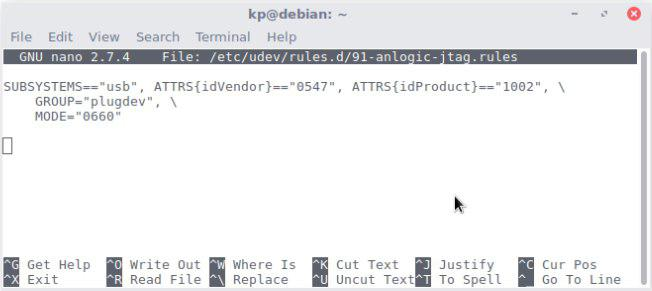
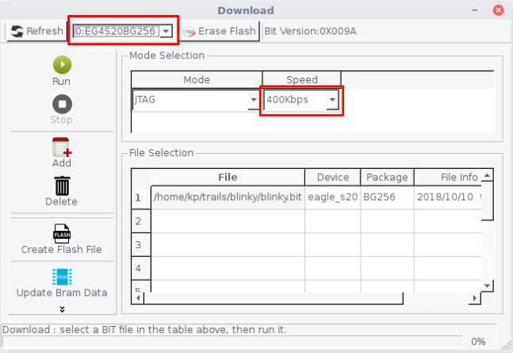

# INSTALL TD on Linux

## Install TD 

We can download TD install-package and get its license from [Download station](https://dl.sipeed.com/shareURL/TANG).
This may take a really long time to download.
But we need it to development tang primer

IDE File name :  `TD_5.0.3_28716_NL_Linux.zip`
License file：`Anlogic_20220703.lic`

After finising downloading, new a terminal and cd into where it is 

```bash
cd <Application path >
```

The /opt directory is reserved for all software and add-on packages that are not installed by default in Linux system, so we new a dirctionary for TD.

```bash
sudo mkdir /opt/TD_DECEMBER2018
```

Extract TD into /opt/TD_DECEMBER2018 dirctionary

```bash
sudo tar -xvf  TD_5.0.3_28716_NL_Linux.zip -d /opt/TD_DECEMBER2018/
```   

## Check for default linux driver

Insert Tang Primer into your computer and execute lsusb to see the information. Make sure USB VID:PID is 0547:1002 as shown in image below


## Create a new udev rule file

Set udev rules to enable Tang Primer to be accessed by the plugdev group

Execute the following command in terminal to create a new udev rules file.

```bash
sudo nano /etc/udev/rules.d/91-anlogic-jtag.rules
```

Copy the following code into text editor and save it, as shown in following image.

```
SUBSYSTEMS=="usb", ATTRS{idVendor}=="0547", ATTRS{idProduct}=="1002", \
  GROUP="plugdev", \
  MODE="0660"

```

Execute the following command in terminal to restart the udev service.

```bash
sudo service udev restart
```

## Check if device detected by Tang Dynasty IDE

Go to <TD installation directory>/bin/ and execute the following command to open TD IDE in GUI mode.

```bash
./td -gui
```

Plugin Tang Primer into your computer and hit Refresh buttion on Download Dialog box.


Plugin Tang Primer into your computer and hit Refresh buttion on Download Dialog box.


> Due to some unknown bug, JTAG only works with 400kbps or lower speed.

