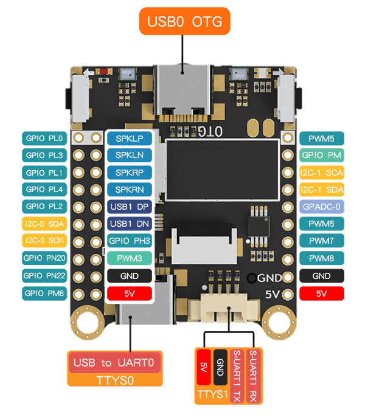

# MaixSense 简介

这个系列和之前的 Maix-i 系列不同，它不仅仅是一个带 AI 加速的 MCU ，还是可以运行 Linux 系统的开发板。

## M2A 板卡

M2A 板卡以全志 R329 为核心，集成电源芯片、FEL烧录按键、

### R329 芯片
全志 R329 双核 Cortex-A53 处理器的 64 位，配备双 HIFI4 DSP 用于音频后处理和预处理，以及 Arm 中国的 AIPU（人工智能处理单元）以极低的功耗提供高达 0.256 TOPS。可以对神经网络进行硬件加速，驱动 720p 的摄像头。

| 项目 | 参数 |
| --- | --- |
| CPU | Dual-core ARM Cortex™-A53@1.5GHz 32KB L1 I-cache + 32KB L1 D-cache per core 256KB L2 cache |
| DSP | Dual-core HiFi4@400MHz  32KB L1 I-cache + 32KB L1 D-cache per core  2MB SRAM |
| NPU | 搭载周易™Z1 AIPU，最大支持0.25TOPS@600MHz |
| 内存 Memory |内置 DDR3 256MB  支持 SPI Nand/Nor/eMMC |
| Audio | Supports 5 audio ADC and 2 audio DAC Supports 5 analog audio inputs and 2 analog audio output Up to 3 I2S/PCM controllers for Bluetooth and external audio codec Integrated digital microphone, supports maximum 8 digital microphones |
| Enthernet | 10/100/1000 Mbps |
| USB | OTG \* 1 Host \* 1|
| SDIO | SDIO 3.0 * 2 |
| I2S | I2S*3(I2S0, I2S1, S-I2S0) |
| SPI | SPI*2(SPI0, SPI1) |
| TWI | TWI*3(TWI0, TWI1, S-TWI0) |
| GPADC | 4-ch |
| SCR | SCR*1 |
| PWM | PWM*15(PWM[8:0], S-PWM[5:0]) |

## MaixSense开发板介绍

MaixSense 开发板可能是市面上最小的 Linux 卡片电脑, 本套件包含一个搭载全志 R329 的高度集成 SOM 核心板，以及一个多功能 IO 扩展底板，可以运行 Linux 系统, 并具备出色的扩展功能。您可以将它用于搭建个人服务器、开发智能语音助手、设计机器人等场景。它通过内置的周易 AIPU 处理器同时支持智能语音和视频图像处理，开发者可以直接在开发板上跑通相关 CV , NLP 等 AI 模型。

**Tina Linux**：全志科技基于 Linux 内核开发的针对智能硬件类产品的嵌入式软件系统。Tina Linux基于 openwrt-14.07 版本的软件开发包,包含了Linux系统开发用到的内核源码、驱动、工具、系统中间件与应用程序包。

但是 MaixSense 不只是可以运行 Tina ，还可以运行**armbian**，这是一个真正**完整**的 linux 系统，armbian 是基于 debian/ubuntu 进行开发的。

|   名称   |               armbian               |               Tina               |
| ------ | --------------------------------- | ------------------------------ |
|   简介   | 专门用于`ARM`开发板的`Debian` |    全志深度修改OpenWRT1404的系统     |
|   特点   |        主线化Linux，功能丰富        |        厂商深度修改，软硬件契合度高        |
| 适用人群 |       极客，嵌入式入门玩家等        | 深度开发，需要自行定制等开发人员 |

## MaixSense外观预览

 

## MaixSense基本参数

<table role="table" class="center_table">
    <thead>
        <tr>
            <th colspan = "2">MaixSense基本参数</th>   
        </tr>
    </thead>
    <tbody>
    <tr>    
        <td>处理器 CPU</td>
        <td>双核 ARM CortexTM-A53™ </td>
    </tr>
    <tr>
        <td>AIPU(NPU)</td>
        <td>搭载周易TZ1AIPU，最大支持0.25TOPS@600MHz</td>
    </tr>
    <tr>
        <td>DRAM</td>
        <td>SIP 256MB DDR3</td>
    </tr>
    <tr>
        <td>存储</td>
        <td>可使用核心板搭载的 SPINAND (默认空贴)存储 可使用底板搭载的SD卡座</td>
    </tr>
    <tr>
        <td>video Encoder 视频编码器</td>
        <td>H264/5 &JPEG,最大720p@30fps</td>
    </tr>
    <tr>
        <td>摄像头</td>
        <td>出厂默认OV9732，最高支持720P@30fps HD 采用USB-C连接器,支持正反插(可分别用作前后摄)</td>
    </tr>
    <tr>
        <td>麦克风</td>
        <td>两个模拟MEMS麦克风，平均灵敏度91dB SPL@1kHz</td>
    </tr>
    <tr>
        <td>屏幕</td>
        <td>1.5寸SPI总线屏幕,屏幕接口采用0.5mm 12P FPC，分辨率240*240</td>
    </tr>
    <tr>
        <td>按键</td>
        <td>1个复位按键和4个用户按键(ADC按键)，1个下载按键(FEL)</td>
    </tr>
    <tr>
        <td>IO引出</td>
        <td>3*10P 2.54mm 引出4个电源引脚(5V/GND)11个GPIO引脚 1个4PMX1.25插座(引出2*GPIO和5V/GND)s</td>
    </tr>
    <tr>
        <td>以太网接口</td>
        <td>在核心板以24P 0.5mm间距FPC的形式引出，用于连接相应PHY</td>
    </tr>
    </tbody>
</table>

## 资料
[MaixSense 资料库](https://dl.sipeed.com/shareURL/MaixII/MaixII-A)

## 产品技术支持
M2A 开发板可以在多种场景实现客户不同方面的需要，在 AIoT 上已经广泛的使用，品质和性能在行业内已经有非常好的口碑，专业的技术团队为广大客户解决硬件设计和软件功能上的各种各样问题。专业技术支持和更详细资料请联系商务<support@sipeed.com>。