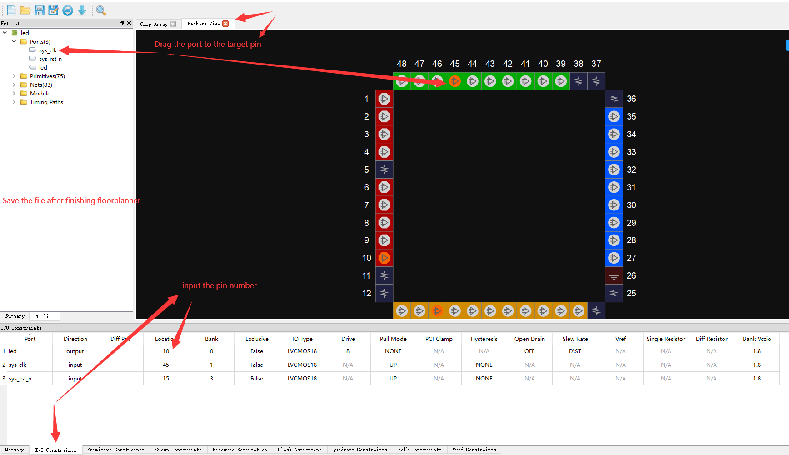
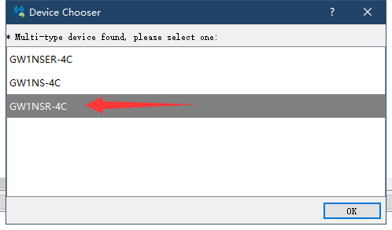
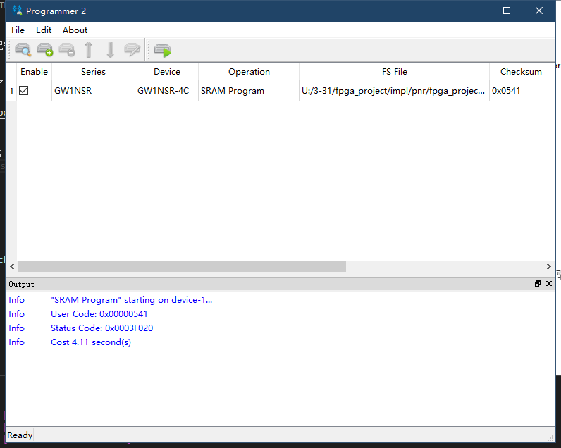

> 编辑于2022年3月31日

- 点灯简单示例

## 新建项目

新建工程：File-->NEW-->FPGA Design Project-->OK
    

弹出的选项框选择存储路径和工程名称（路径和文件名称要求是英文路径）
    

选择对应的型号：
    

- 可能有部分板子主控芯片型号为 C7/I6 ，用户自行选择一下即可

## 编写代码

新建工程之后接下来进行代码编辑，在Design工作栏内新建“Verilog File”,如下图所示：
    

为文件命名（要求写英文名，不然后续综合很容易报错）；
   一般来说文件名称应该和文件内容模块名称相同
    

双击文件，可以在右侧的编辑框中进行代码的编写。
    

以点灯为例，将下方的 示例代码 粘贴到自己的文件中，也可以自己编写自己的代码。

```verilog
module led (
    input   sys_clk,
    input   sys_rst_n,     // reset input
    output  reg led        // LED
);

reg [23:0] counter;        //定义一个变量来计数

always @(posedge sys_clk or negedge sys_rst_n) begin // Counter block
    if (!sys_rst_n)
        counter <= 24'd0;
    else if (counter < 24'd1349_9999)       // 0.5s delay
        counter <= counter + 1;
    else
        counter <= 24'd0;
end

always @(posedge sys_clk or negedge sys_rst_n) begin // Toggle LED
    if (!sys_rst_n)
        led <= 1'b1;
    else if (counter == 24'd1349_9999)       // 0.5s delay
        led <= ~led;                         // ToggleLED
end

endmodule

```

## 综合、约束、布局布线

### 综合

保存编辑的代码后转到“Process”界面下，对编辑好的代码进行综合，即双击“Systhesize”
    

运行之后如没有报错而且 Synthesize 变成下图里的图标
     

说明前面编辑的代码无误；如果有错，根据错误提示进行改正即可。

### 约束

- 此处未涉及时钟约束

想让 Fpga 实现代码的功能，必须将代码中涉及的 端口 绑定到 Fpga 实际的引脚上。

如下图，在左边的工作区点击 process，然后双击 FloorPlanner


在工程中第一次点击，可能会提示说创建文件，点击确定即可


nano 4k的rgb led电路图如下所示
    

| port      | I/O    | pin | desc       |
| --------- | ------ | --- | ---------- |
| sys_clk   | input  | 45  | 时钟输入脚 |
| sys_rst_n | input  | 15  | 系统复位脚 |
| led       | output | 10  | 红灯       |

对于交互式管脚约束有下图中的两种方法
- 将对应的端口拖拽到芯片引脚上
- 在IO约束中输入端口对应的引脚编号

因此对应在管脚约束里的内容应该如下图
  


完成之后记得保存一下

- LED对应的IO10默认是mode Pin，无法直接约束，需要在顶部菜单栏
Project -> Configuration ->Palse&Route -> Dual-Purpose Pin,
勾选 Use MODE as regular IO,如下图


### 布局布线

- 完成脚约束后，接下来进行布局布线操作。


> 失败的话请从头再来一遍

## 烧录到开发板

- 成功完成上面步骤后就已经生成高云的比特流文件了，可以进行下面的步骤来将文件烧录到板子了。

接下来是连接板子，烧录固件，可参照下图选择版型：


在Process界面双击`Program Device` 后打开烧录工具
    


接下来选择 SRAM下载 即可验证程序。有固化需求的自行选择烧录到flash
    


<p id="back">
    <a href="#" onClick="javascript :history.back(-1);">返回上一页(Back)</a>
</p>