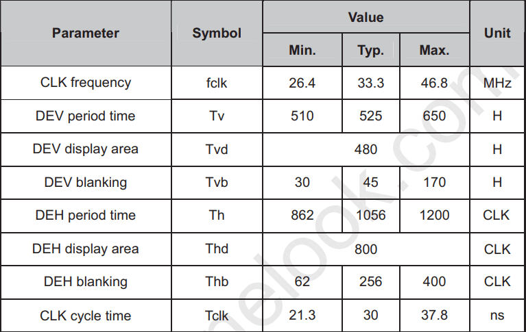
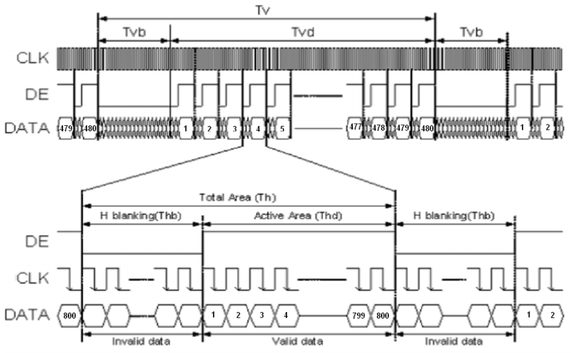

## 先介绍时序

RGB LCD 显示图像的原理和 VGA 类似，都是在计算机内部以数字的方式生成需要显示的图像信息，再通过模数转换的方式，将这些数字的图像信息转变为 RGB 三原色模拟信号，以及行、场同步信号。

下面就介绍 VGA 的时序


上图分别是 VGA 在数据传输中的行同步、场同步时序

从时序图中可以看出，不论是显示一行数据还是一列数据，都需要一个同步(sync)信号，数据的传输需要在两个同步信号的脉冲之间完成

每一行的数据包括显示前沿(back porch)、有效数据(active viedo)、显示后沿(front porch)

其中的有效数据就是我们常说的分辨率，而显示前后沿的参数需要参考具体的分辨率与帧数进行设置，相关参数可以参考典型参数，链接在此： http://www.tinyvga.com/vga-timing

这块屏幕的控制时序略有不同，相关参数的设置可以查看[规格书](./../../assets/files/AT050TN43.pdf)

下面提供了 LCD 相关时序的截图





上面一张图是时序中的参数表，下面的图是时序图

从时序图中看出，这块屏幕可以不用设置前后沿，可以只设置消影(blanking)时间，通过实际的程序证明，两种方式都是可以的

## Verilog实现

### rPll

板载的晶振时钟为 27MHz ，但是我们的屏幕要求 33.3MHZ 的时钟，所以我们需要使用 pll 产生我们需要的时钟

这里需要使用到 `IP Core Generate` ，位置在 Tools -> IP Core Generate；
双击 `rPLL` ，在弹出窗口输入 CLKIN 为 27MHz ，CLKOUT 为 33.3MHz，，Tolerance 选择 0.5%


### lcd时序产生

```verilog
localparam      V_BackPorch = 16'd6; //0 or 45
localparam      V_Pluse 	= 16'd5; 
localparam      HightPixel  = 16'd480;
localparam      V_FrontPorch= 16'd62; //45 or 0

localparam      H_BackPorch = 16'd182; 	
localparam      H_Pluse 	= 16'd1; 
localparam      WidthPixel  = 16'd800;
localparam      H_FrontPorch= 16'd210;

localparam      PixelForHS  =   WidthPixel + H_BackPorch + H_FrontPorch;  	
localparam      LineForVS   =   HightPixel + V_BackPorch + V_FrontPorch;
```

首先是设置时序相关的参数：前沿、后沿、有效像素

关于显示前沿、后沿，前面也说了，可以合并为一个消影时间，就是可以把其中一个设置为0，另一个设置为消影时间。反正前后沿的时间加起来符合表中的时间要求就可以

```verilog
always @(  posedge PixelClk or negedge nRST  )begin
    if( !nRST ) begin
        LineCount       <=  16'b0;    
        PixelCount      <=  16'b0;
        end
    else if(  PixelCount  ==  PixelForHS ) begin
        PixelCount      <=  16'b0;
        LineCount       <=  LineCount + 1'b1;
        end
    else if(  LineCount  == LineForVS  ) begin
        LineCount       <=  16'b0;
        PixelCount      <=  16'b0;
        end
end

//注意这里HSYNC和VSYNC负极性
assign  LCD_HSYNC = (( PixelCount >= H_Pluse)&&( PixelCount <= (PixelForHS-H_FrontPorch))) ? 1'b0 : 1'b1;
assign  LCD_VSYNC = ((( LineCount  >= V_Pluse )&&( LineCount  <= (LineForVS-0) )) ) ? 1'b0 : 1'b1;
```

这段代码产生同步信号，需要注意的是，这块屏幕的同步信号是负极性使能

```verilog
assign  LCD_DE = (  ( PixelCount >= H_BackPorch )&&
                    ( PixelCount <= PixelForHS-H_FrontPorch ) &&
                    ( LineCount >= V_BackPorch ) &&
                    ( LineCount <= LineForVS-V_FrontPorch-1 ))  ? 1'b1 : 1'b0;
                    //这里不减一，会抖动
```

这段代码设置 LCD 使能图像显示，这块屏幕需要控制一个管脚用作显示开关，实际这个信号就是传输图像有效的那 800*480 的数据时置 1

```verilog
assign  LCD_R   =   (PixelCount<200)? 5'b00000 : 
                    (PixelCount<240 ? 5'b00001 :    
                    (PixelCount<280 ? 5'b00010 :    
                    (PixelCount<320 ? 5'b00100 :    
                    (PixelCount<360 ? 5'b01000 :    
                    (PixelCount<400 ? 5'b10000 :  5'b00000 )))));

assign  LCD_G   =   (PixelCount<400)? 6'b000000 : 
                    (PixelCount<440 ? 6'b000001 :    
                    (PixelCount<480 ? 6'b000010 :    
                    (PixelCount<520 ? 6'b000100 :    
                    (PixelCount<560 ? 6'b001000 :    
                    (PixelCount<600 ? 6'b010000 :  
                    (PixelCount<640 ? 6'b100000 : 6'b000000 ))))));

assign  LCD_B   =   (PixelCount<640)? 5'b00000 : 
                    (PixelCount<680 ? 5'b00001 :    
                    (PixelCount<720 ? 5'b00010 :    
                    (PixelCount<760 ? 5'b00100 :    
                    (PixelCount<800 ? 5'b01000 :    
                    (PixelCount<840 ? 5'b10000 :  5'b00000 )))));
```

这段代码用来产生 LCD 的测试数据，产生彩条显示

```verilog
VGAMod	VGAMod_inst
(
    .CLK		(CLK_SYS ),
    .nRST		(nRST	 ),

    .PixelClk	(CLK_PIX ),
    .LCD_DE		(LCD_DEN ),
    .LCD_HSYNC	(LCD_HYNC),
    .LCD_VSYNC	(LCD_SYNC),

    .LCD_B		(LCD_B	 ),
    .LCD_G		(LCD_G	 ),
    .LCD_R		(LCD_R	 )
);
```

最后就是在 TOP 中进行实例化

### 管脚约束

根据硬件原理图可以发现这块FPGA板子与lcd屏幕对应的引脚关系图如下：
例程代码地址：<https://github.com/sipeed/TangNano-9K-examples>
git clone后可以在 lcd_led/src 文件夹内找到相关代码
例程中芯片引脚分布情况如下：

| PORT         |  I/O   | PIN |
| ---          | ---    | --- |
| LED[0]       | output | 10  |
| LED[1]       | output | 11  |
| LED[2]       | output | 13  |
| LED[3]       | output | 14  |
| LED[4]       | output | 15  |
| LED[5]       | output | 16  |
| LCD_B[4]     | output | 41  |
| LCD_B[3]     | output | 42  |
| LCD_B[2]     | output | 51  |
| LCD_B[1]     | output | 53  |
| LCD_B[0]     | output | 54  |
| LCD_G[5]     | output | 55  |
| LCD_G[4]     | output | 56  |
| LCD_G[3]     | output | 57  |
| LCD_G[2]     | output | 68  |
| LCD_G[1]     | output | 69  |
| LCD_G[0]     | output | 70  |
| LCD_R[4]     | output | 71  |
| LCD_R[3]     | output | 72  |
| LCD_R[2]     | output | 73  |
| LCD_R[1]     | output | 74  |
| LCD_R[0]     | output | 75  |
| LCD_DEN      | output | 33  |
| LCD_SYNC     | output | 34  |
| LCD_HYNC     | output | 40  |
| LCD_CLK      | output | 35  |
| XTAL_IN      | input  | 52  |
| Reset_Button | input  | 4   |
| User_Button  | input  | 3   |

### 相关代码

整个工程可以在参考 [这里](https://github.com/sipeed/TangNano-9K-example) ，对应在lcd_led目录下。

