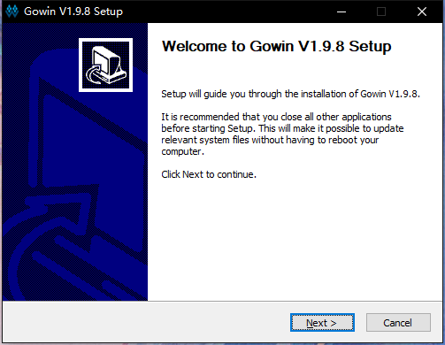
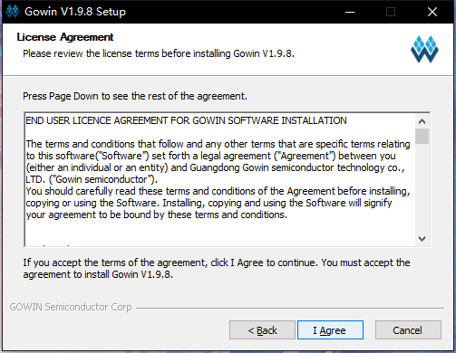
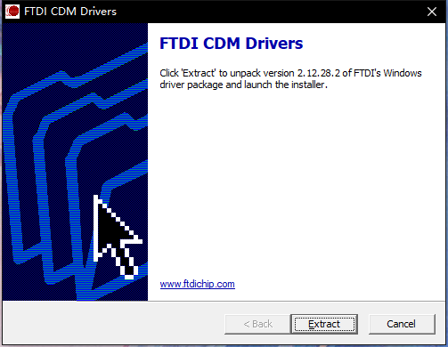

# 安装IDE 

高云云源软件是专门为高云半导体芯片配套的集成电路设计与实现工具。覆盖了FPGA芯片全类型的设计功能，具体功能可以自行到高云官网进行查阅，在此不进行赘述。附上文档链接：<http://www.gowinsemi.com.cn/down.aspx?FId=n14:14:26>


1. 用户安装请根据自己电脑系统进行IDE选择，例如Windows系统的用户用选择带有Win版本的IDE。
2. 不推荐使用教育版本，教育版本安装之后可选芯片仅包含教育使用芯片型号，可选型号稀少。
3. 1.9.8之前的版本已经进行了单机版和联网版license的申请


## 安装软件

此处以安装 **Gowin_V1.9.8_win** 为例进行说明：

按照文档对IDE有了初步了解之后根据文档说明可自行进行IDE的安装。云源软件链接 http://www.gowinsemi.com.cn/faq.aspx


> 由于高云的IDE在不断的更新中，上图为2021年11月30号截图

进入链接后选择“云源软件历史版本”，往下拉找到历史版本中最新版本进行下载，下载到本地的文件夹是一个压缩包格式的文件，进行解压后得到安装包“Gowin_V1.9.8_win.exe”，直接双击开始进行安装：



- 下图的两个都需要安装上


- 下图的安装路径个人按照自己需要设置
  

- 安装中...
  

- 下面这一步不要更改任何东西，按照默认的点击`Finish`就行


- 上面的`Finish`后会出现下面的内容，这是安装驱动的。



- 这里需要选择接受协议才能继续安装
  


- 前面的完成后桌面上会出现下面这种图的图标
  


这样我们就完成了软件的安装

## license 激活

接下来是进行 **license** 的申请，有两种方式：

- 使用单机版 license (需要自己申请 license)

发送申请邮件到 `support@sipeed.com` 来申请license，标题为 `[Apply Tang Lic]MAC: xxxxxx`，内容模板如下：

```
公司名称:
公司网站:
部门:
联系人姓名:
联系人电话:
联系人邮箱:
联系人省份:
计算机MAC地址:
license类型:共享型 仅本机
操作系统类型:Windows Linus
代理商推荐:群策电子 致远达科技 算科电子 欣华隆科技 北高智科技 晶立达科技 其他
```

打开高云 IDE 的时候，在弹出的 license 管理中，选择自己本地 license 的文件


下面是另一种添加方法， 使用 sipeed 的 license 服务器联网激活

### 使用 sipeed 的 license 服务器联网激活

这种方式配置起来简单，不过没有网络的情况下无法使用软件

安装好软件并打开后，软件会提示需要 license，在弹出框中填入服务器地址 `45.33.107.56` 即可，端口：10559


> 在线许可服务器仅适用于 GoWin V1.9.8 及更低版本，推荐使用 V1.9.6
双击打开“Gowin_V1.9.8”会看到


在此主要以“Use Floating License server”一栏进行测试


输入后点击“Save”,在联网的情况下重新打开应用可以直接进入使用界面：


到此，安装结束。


## 拓展
- IDE 的安装路径下主要有如下几个文件夹：IDE、Programmer、uninst.exe；
- **IDE** 文件夹：主要介绍次路径下的 **doc** 文件夹，用户在安装完之后可以在这个路径下进行对 IDE 的基本了解，主要包含文件如下图所示：


> “Programmer”：附带的烧录软件
> “uninst.exe”：卸载工具


## 使用方法

参考官方文档[Gowin云源软件用户指南](http://cdn.gowinsemi.com.cn/SUG100-1.8_Gowin%E4%BA%91%E6%BA%90%E8%BD%AF%E4%BB%B6%E7%94%A8%E6%88%B7%E6%8C%87%E5%8D%97.pdf)，第5章 云源软件使用

## 参考文档

+ [高云软件简介和安装](http://cdn.gowinsemi.com.cn/%E9%AB%98%E4%BA%91%E8%BD%AF%E4%BB%B6%E7%AE%80%E4%BB%8B%E5%92%8C%E5%AE%89%E8%A3%85.pdf)


## Linux 烧录教程


在Ubuntu系统下我们建议使用**openFPGALoader**烧写，以下为具体步骤

### 安装openFPGALoader
参考：https://trabucayre.github.io/openFPGALoader/guide/install.html
```
# preprocess
sudo apt-get install libftdi1-2 libftdi1-dev libhidapi-hidraw0 \
  libhidapi-dev libudev-dev zlib1g-dev cmake pkg-config make g++
# compile
git clone https://github.com/trabucayre/openFPGALoader.git
cd openFPGALoader
mkdir build
cd build
cmake ../ # add -DBUILD_STATIC=ON to build a static version
          # add -DENABLE_UDEV=OFF to disable udev support and -d /dev/xxx
          # add -DENABLE_CMSISDAP=OFF to disable CMSIS DAP support
cmake --build .
# or
# make -j$(nproc)
# install
sudo make install
```

### 烧录方法
检测板卡
```
$ ./openFPGALoader --detect
Jtag frequency : requested 6.00MHz   -> real 6.00MHz  
index 0:
	idcode 0x100481b
	manufacturer Gowin
	family GW1N
	model  GW1N(R)-9C
	irlength 8
detach error -5

```
下载码流
```
$ ./openFPGALoader -b tangnano9k -f ../../nano9k_lcd/impl/pnr/Tang_nano_9K_LCD.fs
write to flash
Jtag frequency : requested 6.00MHz   -> real 6.00MHz  
Parse file Parse ../../nano9k_lcd/impl/pnr/Tang_nano_9K_LCD.fs: 
Done
DONE
Jtag frequency : requested 2.50MHz   -> real 2.00MHz  
erase SRAM Done
erase Flash Done
write Flash: [==================================================] 100.00%
Done
CRC check: Success
detach error -5

```

其中-b表示目标板型，可以使用以下取值：

|Board name|FPGA|Memory|Flash|
|--|--|--|--|
|tangnano|GW1N-1 QFN48|OK|Internal Flash|
|tangnano1k|GW1NZ-1 QFN48|OK|Internal Flash|
|tangnano4k|GW1NSR-4C QFN48|OK|Internal Flash/External Flash|
|tangnano9k|GW1NR-9C QFN88|OK|Internal Flash/External Flash|


