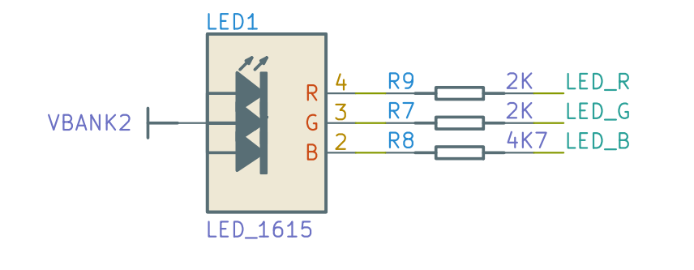

# 自己点灯

1. 新建工程：File-->NEW-->FPGA Dsign Project-->OK
    

2. 弹出的选项框选择存储路径和工程名称（路径和文件名称要求是英文路径）
    

3. 选择对应的型号：
    
    
4. 新建好工程之后接下来进行代码编辑，在Design工作栏内新建“Verilog File”,如下图所示：
    
5. 为文件命名（要求写英文名，不然后续综合很容易报错）
    
    
6. 双击新建的 .v 文件，可以在右侧的编辑框中编写代码。
以流水灯为例；将下方的代码粘贴到自己的文件中，也可以自己编写代码。

```verilog
module led (
    input sys_clk,
    input sys_rst_n,
    output reg [2:0] led // 110 B, 101 R, 011 G
);

reg [23:0] counter;

always @(posedge sys_clk or negedge sys_rst_n) begin
    if (!sys_rst_n)
        counter <= 24'd0;
    else if (counter < 24'd1199_9999)       // 0.5s delay
        counter <= counter + 1;
    else
        counter <= 24'd0;
end

always @(posedge sys_clk or negedge sys_rst_n) begin
    if (!sys_rst_n)
        led <= 3'b110;
    else if (counter == 24'd1199_9999)       // 0.5s delay
        led[2:0] <= {led[1:0],led[2]};
    else
        led <= led;
end

endmodule

 ```

7. 代码编辑保存后转到“Process”界面下，对编辑好的代码进行综合，即双击“Systhesize”
    
        
    显示 xxxxxxx finish 后即可进行下一步

8.  接下来通过  双击 Process 界面里的FloorPlanner来设置管脚约束。第一次打开会弹出缺少.cst文件.选择“OK”即可；
    

9. nano 的rgb led电路图如下所示
    

    整个项目需要约束的引脚如下

| port      | I/O    | pin | desc       |
| --------- | ------ | --- | ---------- |
| sys_clk   | input  | 35  | 时钟输入脚  |
| sys_rst_n | input  | 15  | 系统复位脚  |
| led[0]    | output | 16  | 绿灯       |
| led[1]    | output | 17  | 蓝灯       |
| led[2]    | output | 18  | 红灯       |


在打开的界面中按照序号的顺序来进行相应的操作（两种方式选择一种即可）


- 直接编写约束文件希望用户自行研究

10. 到“Process”下运行“Place&Route”，即运行管脚布局布线，运行结果如下图所示：
    

11. 接下来是进行连接板子，烧录固件。在Process界面双击`Program Device` 后打开烧录工具
    

12. 接下来选择sram烧录即可验证程序。
    
    

点灯验证到此结束。

