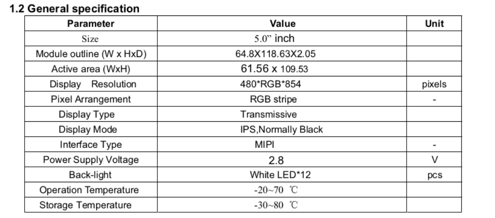
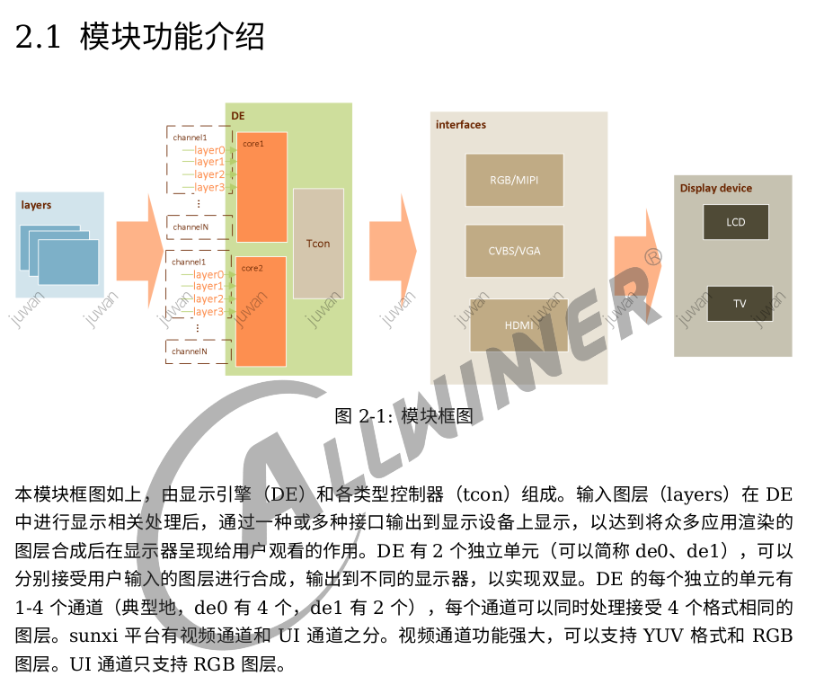
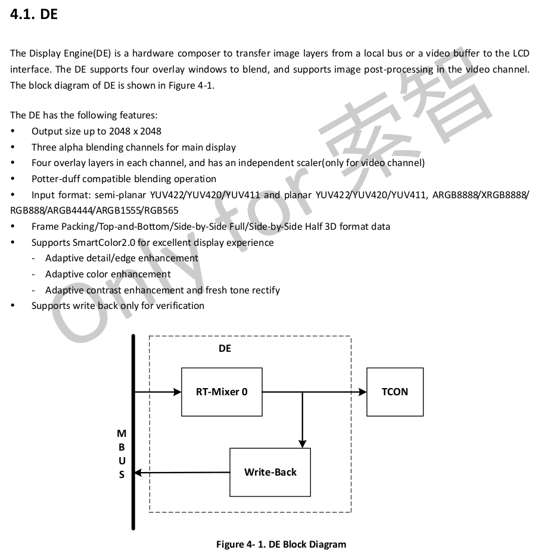
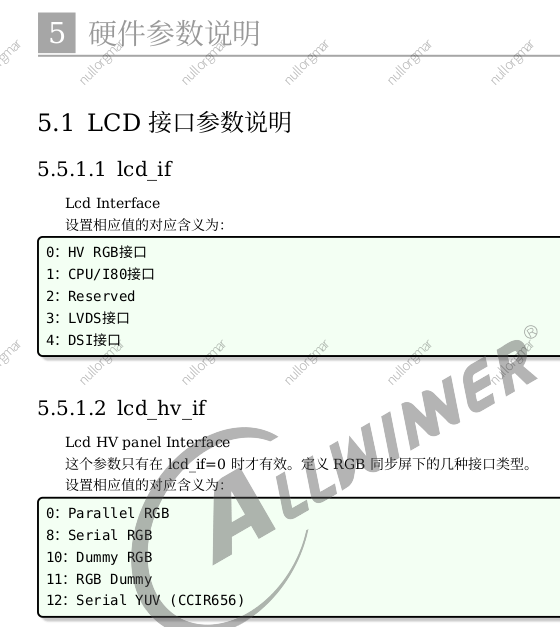
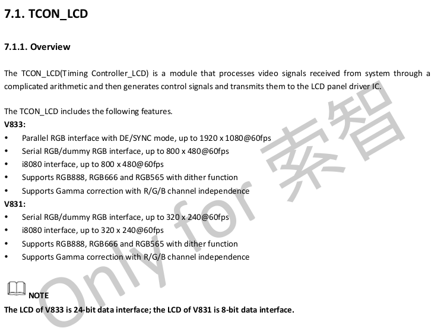
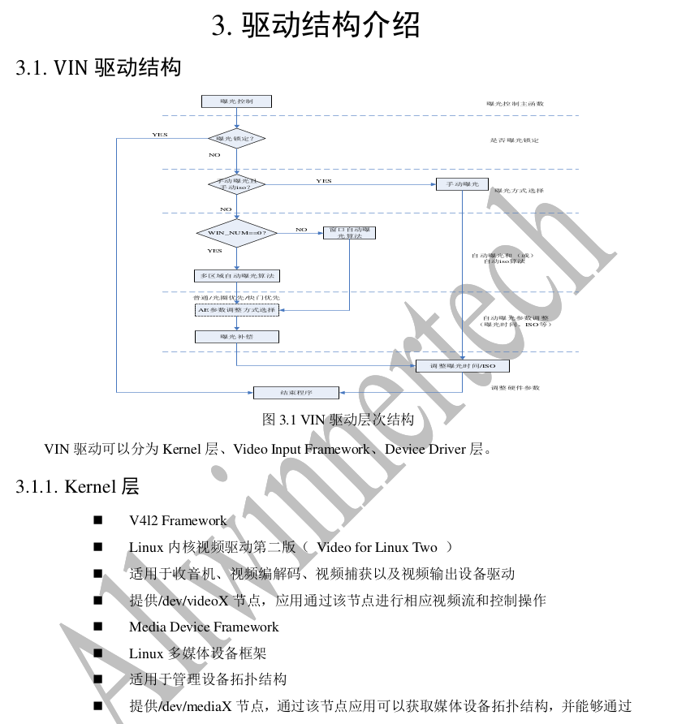

原文链接：https://www.cnblogs.com/juwan/p/15226245.html
作者：[人 類 開 源 補 完 計 劃](https://www.cnblogs.com/juwan)

> 搬运时间：2022年3月11日

本次文章如下内容:
- [关于编译、测试、打包镜像的基础用法，以及常见的注意点](#关于编译测试打包镜像的基础用法以及常见的注意点)
- [关于 Tina Linux 的 kernel 和 package 的速成用法](#关于-tina-linux-的-kernel-和-package-的速成用法)
- [关于适配和测试常见的基础外设驱动，从上层用户空间的软件到底层硬件寄存器之间的联系。](#关于适配和测试常见的基础外设驱动从上层用户空间的软件到底层硬件寄存器之间的联系)
- [拓展介绍给 SDK 加入没有的外设驱动调试和开发流程](#拓展介绍给-sdk-加入没有的外设驱动调试和开发流程)
- [总结一下](#总结一下)
  
内容可能有点多，需要的话以后可以再来查阅。

目前V833 SDK已经公开 https://github.com/Tina-V833/tina-V833 

## 关于编译、测试、打包镜像的基础用法，以及常见的注意点
配置基础编译系统的方法看 [R329 SDK 上手编译与烧录! ](https://wiki.sipeed.com/soft/Lichee/zh/MaixSense/contribution/R329_SDK_%E7%BC%96%E8%AF%91%E4%B8%8E%E7%83%A7%E5%BD%95.html)，最好用 ubuntu18 ~ 20 ，问题少一点，解决方法多一点。

在这里列一下必要的库，编译与测试环境在 ubuntu20 （wsl2）建议大于 8G 内存。

- 连接开发板 https://r329.docs.allwinnertech.com/devboardstudy/r329evb5studyadbuart/
- 编译环境配置 https://r329.docs.allwinnertech.com/devboardstudy/r329evb5ubuntu/

上面两篇参考资料废话很多，如果你已经有经验了，就直接开始吧。

基础环境的安装：

> sudo apt-get -y install build-essential asciidoc binutils bzip2 gawk gettext git libncurses5-dev libz-dev patch python3 python2.7 unzip zlib1g-dev lib32gcc1 libc6-dev-i386 subversion flex uglifyjs git-core gcc-multilib p7zip p7zip-full msmtp libssl-dev texinfo libglib2.0-dev xmlto qemu-utils upx libelf-dev autoconf automake libtool autopoint device-tree-compiler g++-multilib antlr3 gperf wget curl swig rsync intltool busybox cmake


Ubuntu20 要增强一下，补一下下面两个包 libffi6 （python3 需要）。
```
wget http://mirrors.kernel.org/ubuntu/pool/main/libf/libffi/libffi6_3.2.1-8_amd64.deb
sudo apt install ./libffi6_3.2.1-8_amd64.deb
sudo apt-get install uuid-dev
```

其他的，自己缺了就找一下。

以 Tina Linux 为例，它以 openwrt linux 系统为原型，所以编译方法是相通的，只是会多一点自己的特色。

有如下基础用法，这里只是简化和说明源头：

source build/envsetup.sh
```bash
== before all ==
- lunch:        lunch <product_name>-<build_variant>

== build project ==
- m:            Make from the top of the tree.
- mm:           Build package in the current directory, but not their dependencies.
- mmb:          Clean and build package in the current directory, but not their dependencies.
- p:            Pack from the top of the tree.
- pd:           Pack card0 from the top of the tree.
- mp:           Make and pack from the top of the tree
- mpd:          Make and pack card0 from the top of the tree
- mboot:        Build boot0 and uboot, including uboot for nor.
- mboot0:       Just build boot0.
- muboot:       Build uboot, including uboot for nor.
- muboot_nor:   Just build uboot for nor.
- mkernel:      Build kernel.
- mlibc:        Build c library.

== jump directory ==
- croot:    Jump to the top of the tree.
- cboot:    Jump to uboot.
- cboot0:   Jump to boot0.
- cdts:     Jump to device tree.
- cbin:     Jump to uboot/boot0 bin directory.
- ckernel:  Jump to kernel.
- cdevice:  Jump to target.
- ccommon:  Jump to platform common.
- cconfigs: Jump to configs of target.
- cout:     Jump to out directory of target.
- ctarget:  Jump to target of compile directory.
- crootfs:  Jump to rootfs of compile directory.
- ctoolchain: Jump to toolchain directory.
- callwinnerpk: Jump to package allwinner directory.
- ctinatest:  Jump to tinateset directory.
- godir:    Go to the directory containing a file.

== grep file ==
- cgrep:    Greps on all local C/C++ files.
```

命令主要就用这几个就好。

croot 到工程根目录， cout 同理到 out 编译目录。

make 编译工程全部内容，mkernel 同理单独编译 kernel （mboot 同理）。

make menuconfig 和 make kernel_menuconfig 分别是配置 package 和 kernel 的所选功能的。

pack 打包当前的编译结果成一个 img 文件，供 livesuit 工具烧录。

全志的烧录工具网上多，不过在 linux 开发的话要看一下这个仓库 https://github.com/jake5253/allwinner-livesuit 或这个 https://github.com/junhuanchen/sunxi-livesuite （我改了一点说明在 ubuntu 20 上使用）。

cgrep test 是快速的 grep -rn "test" 查代码用的。

> 由于硬件的 uboot 配置已经被适配过，所以可以不用特别关注启动方面的配置，极小概率会去修改的，之后有必要会代入说明。

现在我们具备了编译，打包，烧录的基础，顺便说一下一些常用的注意点。

make 只在 croot 的目录下有效，编译主要分 uboot kernel package 三大块的编译。

我们通常只需要关心 package 编译即可，编译系统和 openwrt 一致，这个可以从网上获取相关用法。

单包编译 `make package/allwinner/eyesee-mpp/middleware/compile`

清理单包 `make package/allwinner/eyesee-mpp/middleware/clean`

> 参考资料 [在openwrt上编译一个最简单的ipk包](https://www.cnblogs.com/qingchen1984/p/6768602.html)

具体的包描述可以看目录下的 Makefile 和 Config.in ，如果想要加一个包，就可以通过仿照其他包加入编译系统，甚至是从 github 获取别人移植好的包。

例如给系统加入 libuv ，我们可以[github搜索](https://github.com/search?q=define+Package%2Flibuv&type=code) 到获得别人加入的。

这样一些软件包的编译规则就可以不用自己写了，这是一个软件包常用的偷懒小技巧，驱动代码有时候也可以这样操作，但自己最好熟悉整体的编译系统是最好的。

```makefile
#
# Copyright (C) 2015-2017 OpenWrt.org
#
# This is free software, licensed under the GNU General Public License v2.
# See /LICENSE for more information.
#

include $(TOPDIR)/rules.mk

PKG_NAME:=libuv
PKG_VERSION:=1.42.0
PKG_RELEASE:=1

PKG_SOURCE:=$(PKG_NAME)-v$(PKG_VERSION).tar.gz
PKG_SOURCE_URL:=http://dist.libuv.org/dist/v$(PKG_VERSION)/
# PKG_HASH:=61a90db95bac00adec1cc5ddc767ebbcaabc70242bd1134a7a6b1fb1d498a194
PKG_BUILD_DIR:=$(BUILD_DIR)/$(PKG_NAME)-v$(PKG_VERSION)

PKG_MAINTAINER:=Marko Ratkaj <marko.ratkaj@sartura.hr>
PKG_LICENSE:=MIT
PKG_LICENSE_FILES:=LICENSE
PKG_CPE_ID:=cpe:/a:libuv_project:libuv

CMAKE_INSTALL:=1
CMAKE_BINARY_SUBDIR:=out/cmake
PKG_BUILD_PARALLEL:=1

include $(BUILD_DIR)/package.mk
include $(BUILD_DIR)/cmake.mk

define Package/libuv
  SECTION:=libs
  CATEGORY:=Libraries
  TITLE:=Cross-platform asychronous I/O library
  URL:=https://libuv.org/
  DEPENDS:=+libpthread +librt
  ABI_VERSION:=1
endef

define Package/libuv/description
 libuv is a multi-platform support library with a focus on asynchronous I/O. It
 was primarily developed for use by Node.js, but it's also used by Luvit, Julia,
 pyuv, and others.
endef

CMAKE_OPTIONS += -DBUILD_TESTING=OFF

define Build/InstallDev
	$(call Build/InstallDev/cmake,$(1))
	$(SED) 's,/usr/include,$$$${prefix}/include,g' $(1)/usr/lib/pkgconfig/libuv.pc
	$(SED) 's,/usr/lib,$$$${prefix}/lib,g' $(1)/usr/lib/pkgconfig/libuv.pc
endef

define Package/libuv/install
	$(INSTALL_DIR) $(1)/usr/lib/
	$(CP) $(PKG_INSTALL_DIR)/usr/lib/libuv.so* $(1)/usr/lib/
endef

$(eval $(call BuildPackage,libuv))
```

这里会演示和讲解一下上面这个包是如何参与编译和调试的，注意目录下 Config.in 主要影响 make menuconfig 搜索到这个包，如果勾选功能就会调起 Makefile 影响具体的编译，有一些常见的宏需要联系上下文获取，如 交叉编译的 gcc ，编译输出的目录，拷贝哪些资源和程序到 rootfs 下，有一些包如何和 kernel 模块联系，主要有纯粹软件包也有底层驱动包，还有 openwrt 提供的 luci feed 软件源，但这个对我们的使用影响很小，因为我们不是用作路由器的 web 服务。

> 如果到这里了还没有编译出系统镜像的，就不用继续往下看了，基本功都不过关。

## 关于 Tina Linux 的 kernel 和 package 的速成用法

- 继续往下看的前提是你已经将系统编译出来并将其烧录系统启动进入终端了。

先从设备树的结点开始说起，如果你从来没有接触过设备树，可以在这里简单的了解一下。

设备树是一个存放驱动具体配置信息的文件，其中 dtb 是 dts 的编译产物，内核 kernel 可以通过 dts 去配置要加载的驱动的一些配置信息。

举个例子，如果你想要给系统添加一个 RTC 设备，那么可以在 device/config/chips/v833/configs/xxxx/board.dts 中依次定义树结点。
```dts
&twi4 {
  pcf8563: rtc@51 {
    compatible = "nxp,pcf8563";
    reg = <0x51>;
  };
};
```
这样的配置意味着 kernel 在启动的时候要去负责调驱动程序，如果驱动成功则会注册一个 rtc 设备到 /dev/rtcX 中，可能是 /dev/rtc1 等等。
接着这个驱动会需要 twi4 的结点，因此会定义下面这个结点。
```dts
    twi4: twi@0x07081400 {
      pinctrl-0 = <&twi0_pins_a>;
      pinctrl-1 = <&twi0_pins_b>;
      status = "okay";
    };

    pinctrl@0300b000 {

      twi0_pins_a: twi0@0 {
        allwinner,pins = "PE16", "PE17";
        allwinner,pname = "twi0_scl", "twi0_sda";
        allwinner,function = "twi0";
        allwinner,muxsel = <5>;
        allwinner,drive = <1>;
        allwinner,pull = <0>;
      };

      twi0_pins_b: twi0@1 {
        allwinner,pins = "PE16", "PE17";
        allwinner,function = "io_disabled";
        allwinner,muxsel = <7>;
        allwinner,drive = <1>;
        allwinner,pull = <0>;
      };
   }
```
   其中 twi4 对应 /dev/i2c-4 的设备，其中 twi0_pins_a 和 twi0_pins_b 表示具体的 GPIO 引脚配置。

需要注意的是，驱动配置的字符串都是可以随意设计的，因为具体结点项的使用会在驱动代码中通过 of_property_read_xxxx 系列函数获取对应的配置描述，所以不同 SOC 的定义都会有所不同。

但为什么要这样配置呢？通常 SOC 厂家会提供底层的基础结点配置（如 sun8iw19p1.dtsi 类似于 .h 和 .c 的关系），开发的时候只需要继承其结点配置即可。

/linux-4.9/arch/arm/boot/dts/sun8iw19p1.dtsi
/linux-4.9/arch/arm/boot/dts/sun8iw19p1-pinctrl.dtsi
/linux-4.9/arch/arm/boot/dts/sun8iw19p1-clk.dtsi

但设备树结点具体怎么配置是要结合驱动程序来看的，可以参考我以前的这篇文章，[为 AW V831 配置 spidev 模块，使用 py-spidev 进行用户层的 SPI 通信](https://www.cnblogs.com/juwan/p/14341406.html)。，这篇文章主要交代了如何在上层和底层以及外设输出测量做了说明和示范。

> 这里我可以拿一些 屏幕 、 摄像头 、外设设备之类的做一下演示。

## 关于适配和测试常见的基础外设驱动，从上层用户空间的软件到底层硬件寄存器之间的联系。
有了基本的修改驱动和设备树的能力以后，我们来主动实现一些 SDK 没有的功能，首先要熟悉一下 SDK 的编译框架构成，以便于我们添加代码和模块进入。

先从 kernel 开始说起，kernel 里的驱动代码，我们需要掌握挂载、修改、调试它的认知。

对于 linux 的 module 模块的基础开发方法可以看这个仓库[linux_python_ioctl_driver](https://github.com/junhuanchen/linux_python_ioctl_driver)，基本用法就是 insmod 和 rmmod 、lsmod，在 X86 上稍微学习一下 IOCTL 的操作接口就行，，学会加载 .ko 释放、查看等等（这里可以简单演示一下）。

到这里要知道内核模块 .ko 不同于链接库 .so 模块的代码结构以及使用方法上的差异就行，大多数时候用不着写原始驱动，拿过来改改就行。

然后知道了这个以后，还需要知道一些调试模块的使用，例如 dmesg 、 debugfs 和 sysfs 的使用。

如何理解呢？拿屏幕操作来说吧。某个屏幕驱动出了问题，需要确认驱动的情况。

使用 dmesg 可以查看我们在 kernel 下写的 printk 输出的内容，只能看到输出的结果，不能进行交互。

想要交互，我们可以通过 debugfs 或 sysfs 与内核模块进行文件内容的交换，例如下述的这类用法作为参考。


访问这些文件进行读写就等于调用驱动代码的这些操作，驱动在加载的时候会去创建这些结点出来供用户空间调用和传递数据。下面是在/v831/lichee/linux-4.9/drivers/video/fbdev/sunxi/disp2/disp/dev_disp_debugfs.c的文件内容
```C
/*
 * Allwinner SoCs display driver.
 *
 * Copyright (C) 2016 Allwinner.
 *
 * This file is licensed under the terms of the GNU General Public
 * License version 2.  This program is licensed "as is" without any
 * warranty of any kind, whether express or implied.
 */

#if defined(CONFIG_DISP2_SUNXI_DEBUG)

#include "dev_disp_debugfs.h"

static struct dentry *my_dispdbg_root;


struct dispdbg_data {
	char command[32];
	char name[32];
	char start[32];
	char param[64];
	char info[256];
	char tmpbuf[318];
};
static struct dispdbg_data dispdbg_priv;

static void dispdbg_process(void)
{
	unsigned int start;
	int err;

	err = kstrtou32(dispdbg_priv.start, 10, &start);
	if (err) {
		pr_warn("Invalid para\n");
		return;
	}

	if (start != 1)
		return;

	if (!strncmp(dispdbg_priv.name, "layer", 5)) {
		char *p = dispdbg_priv.name + 5;
		char *token = p;
		unsigned int disp, chan, id;
		struct disp_layer *lyr = NULL;

		pr_warn("%s,%s\n", dispdbg_priv.command, dispdbg_priv.name);

		token = strsep(&p, " ");
		if (!token) {
			pr_warn("Invalid para\n");
			return;
		}
		err = kstrtou32(token, 10, &disp);
		if (err) {
			pr_warn("Invalid para\n");
			return;
		}
		token = strsep(&p, " ");
		if (!token) {
			pr_warn("Invalid para\n");
			return;
		}
		err = kstrtou32(token, 10, &chan);
		if (err) {
			pr_warn("Invalid para\n");
			return;
		}
		token = strsep(&p, " ");
		if (!token) {
			pr_warn("Invalid para\n");
			return;
		}
		err = kstrtou32(token, 10, &id);
		if (err) {
			pr_warn("Invalid para\n");
			return;
		}
		lyr = disp_get_layer(disp, chan, id);
		if (lyr == NULL) {
			sprintf(dispdbg_priv.info, "get %s fail!",
				dispdbg_priv.name);
			return;
		}
		if (!strncmp(dispdbg_priv.command, "enable", 6)) {
			/* lyr->enable(lyr); */
		} else if (!strncmp(dispdbg_priv.command, "disable", 7)) {
			/* lyr->disable(lyr); */
		} else if (!strncmp(dispdbg_priv.command, "getinfo", 7)) {
			lyr->dump(lyr, dispdbg_priv.info);
		} else {
			sprintf(dispdbg_priv.info,
				"not support command for %s!",
				dispdbg_priv.name);
			return;
		}
```
意味着你可以通过这个接口产生的文件和内核进行数据交换，这层是属于直接显示驱动的，还有显示框架的功能可以使用，例如下图。


这里只是对屏幕显示驱动的调试做个一个示范，其他的也同理，细节可以参考 D1_Linux_Display_开发指南.pdf 一文。

如果这一切都十分正常的话，还是出现了错误，我们就需要检查一下寄存器了，这时候我们可以这样做。

这里我拿 定义 PWM 到绑定 GPIO 的寄存器配置做一个简单的示范。

首先知道用户空间提供的读写寄存器的接口，这个也和上述一致，只是底层开了这类接口给到 sysfs 了，可以参考 sunxi_dump_reg使用说明书.pdf 

我拿一个调试 pwm 设备的时候案例来举例，当把设备驱动、结点配置好了，驱动也写好了，当输出仍然没有反应，最终发现是寄存器的引脚 function 没有选到 pwm 而是 disable 的情况。

pwm 的控制方法如下：
```bash
# pwm debug
cat /sys/kernel/debug/pwm

# pwm设置
echo 2 > /sys/class/pwm/pwmchip0/export && echo 100000 > /sys/class/pwm/pwmchip0/pwm2/period && echo 20000 > /sys/class/pwm/pwmchip0/pwm2/duty_cycle && echo 1 > /sys/class/pwm/pwmchip0/pwm2/enable

echo 3 > /sys/class/pwm/pwmchip0/export && echo 100000 > /sys/class/pwm/pwmchip0/pwm3/period && echo 20000 > /sys/class/pwm/pwmchip0/pwm3/duty_cycle && echo 1 > /sys/class/pwm/pwmchip0/pwm3/enable
```
现在我们来查阅 V833／V831_Datasheet_V1.1(For 索智).pdf 获取对应寄存器的地址信息，把输出的结果翻译过来，有时候发现某个设备的控制操作存在问题，直接对寄存器写入做最终配置，就可以检查到为什么了。

首先定位 GPIO 的基地址：0x0300B000


接着定位到具有 pwm 功能的引脚 PD PH 组，如果是 PH 则地址偏移为 0x0300B000 + 0xfc (PH_CFG0) = 0x0300B0FC。

可以从该寄存器得知 PH 0:7 的功能选择情况，从图中可知其 四位 bit 为一组，现在我们可以用上述的方法对其进行修改和写入，从而实现的开和关，甚至是重新配置。
```bash
cd /sys/class/sunxi_dump/
echo 0x0300B0FC > dump
cat dump

root@sipeed:/# cd /sys/class/sunxi_dump/
root@sipeed:/sys/class/sunxi_dump# echo 0x0300B0FC > dump
root@sipeed:/sys/class/sunxi_dump# cat dump
0x74471255
root@sipeed:/sys/class/sunxi_dump# 

# 0x74471255 > 
# 0b1110100010001110001001001010101 > 
# 0b 0111 0100 0100 0111 0001 0010 0101 0101 > 
# 0b 0111 0100 0100 0111 0001 0010 0111 0111 >
# 0b1110100010001110001001001110111 >
# 0x74471277
# 关闭最后两个 io 引脚的 function 的使用

cd /sys/class/sunxi_dump
echo 0x0300B0FC 0x74471277 > write
cat write

root@sipeed:/# cd /sys/class/sunxi_dump
root@sipeed:/sys/class/sunxi_dump# echo 0x0300B0FC 0x74471277 > write
root@sipeed:/sys/class/sunxi_dump# cat write
reg         to_write    after_write
0x0300b0fc  0x74471255  0x74471277 
root@sipeed:/sys/class/sunxi_dump# 
```
以上上述操作就是打印寄存器和写入方法，通过这种方式可以跳过驱动和用户程序，直接将最终的寄存器配置结果设置上。
> 提供一种简单的方法
```bash
cat /sys/kernel/debug/pinctrl/pio/pinmux-pins
root@sipeed:/# cat /sys/kernel/debug/pinctrl/pio/pinmux-pins 
Pinmux settings per pin
Format: pin (name): mux_owner gpio_owner hog?
pin 64 (PC0): sdc2 (GPIO UNCLAIMED) function sdc2 group PC0
pin 65 (PC1): sdc2 (GPIO UNCLAIMED) function sdc2 group PC1
pin 66 (PC2): (MUX UNCLAIMED) (GPIO UNCLAIMED)
pin 67 (PC3): (MUX UNCLAIMED) (GPIO UNCLAIMED)
pin 68 (PC4): sdc2 (GPIO UNCLAIMED) function sdc2 group PC4
pin 69 (PC5): sdc2 (GPIO UNCLAIMED) function sdc2 group PC5
pin 70 (PC6): sdc2 (GPIO UNCLAIMED) function sdc2 group PC6
pin 71 (PC7): sdc2 (GPIO UNCLAIMED) function sdc2 group PC7
pin 72 (PC8): sdc2 (GPIO UNCLAIMED) function sdc2 group PC8
pin 73 (PC9): sdc2 (GPIO UNCLAIMED) function sdc2 group PC9
pin 74 (PC10): (MUX UNCLAIMED) (GPIO UNCLAIMED)
pin 75 (PC11): sdc2 (GPIO UNCLAIMED) function sdc2 group PC11
pin 96 (PD0): (MUX UNCLAIMED) (GPIO UNCLAIMED)
pin 97 (PD1): soc@03000000:lcd0@01c0c000 (GPIO UNCLAIMED) function lcd0 group PD1
pin 98 (PD2): soc@03000000:lcd0@01c0c000 (GPIO UNCLAIMED) function lcd0 group PD2
pin 99 (PD3): soc@03000000:lcd0@01c0c000 (GPIO UNCLAIMED) function lcd0 group PD3
pin 100 (PD4): soc@03000000:lcd0@01c0c000 (GPIO UNCLAIMED) function lcd0 group PD4
pin 101 (PD5): soc@03000000:lcd0@01c0c000 (GPIO UNCLAIMED) function lcd0 group PD5
pin 102 (PD6): soc@03000000:lcd0@01c0c000 (GPIO UNCLAIMED) function lcd0 group PD6
pin 103 (PD7): soc@03000000:lcd0@01c0c000 (GPIO UNCLAIMED) function lcd0 group PD7
pin 104 (PD8): soc@03000000:lcd0@01c0c000 (GPIO UNCLAIMED) function lcd0 group PD8
pin 105 (PD9): (MUX UNCLAIMED) (GPIO UNCLAIMED)
pin 106 (PD10): (MUX UNCLAIMED) (GPIO UNCLAIMED)
pin 107 (PD11): (MUX UNCLAIMED) pio:107
pin 108 (PD12): (MUX UNCLAIMED) (GPIO UNCLAIMED)
pin 109 (PD13): (MUX UNCLAIMED) (GPIO UNCLAIMED)
pin 110 (PD14): (MUX UNCLAIMED) (GPIO UNCLAIMED)
pin 111 (PD15): (MUX UNCLAIMED) (GPIO UNCLAIMED)
pin 112 (PD16): (MUX UNCLAIMED) (GPIO UNCLAIMED)
pin 113 (PD17): (MUX UNCLAIMED) (GPIO UNCLAIMED)
pin 114 (PD18): soc@03000000:lcd0@01c0c000 (GPIO UNCLAIMED) function lcd0 group PD18
pin 115 (PD19): soc@03000000:lcd0@01c0c000 (GPIO UNCLAIMED) function lcd0 group PD19
pin 116 (PD20): (MUX UNCLAIMED) (GPIO UNCLAIMED)
pin 117 (PD21): soc@03000000:lcd0@01c0c000 (GPIO UNCLAIMED) function lcd0 group PD21
pin 118 (PD22): soc@03000000:pwm9@0300a000 (GPIO UNCLAIMED) function pwm9 group PD22
pin 128 (PE0): csi1 (GPIO UNCLAIMED) function csi1 group PE0
pin 129 (PE1): sensor1 (GPIO UNCLAIMED) function csi_mclk1 group PE1
pin 130 (PE2): csi1 (GPIO UNCLAIMED) function csi1 group PE2
pin 131 (PE3): csi1 (GPIO UNCLAIMED) function csi1 group PE3
pin 132 (PE4): csi1 (GPIO UNCLAIMED) function csi1 group PE4
pin 133 (PE5): csi1 (GPIO UNCLAIMED) function csi1 group PE5
pin 134 (PE6): csi1 (GPIO UNCLAIMED) function csi1 group PE6
pin 135 (PE7): csi1 (GPIO UNCLAIMED) function csi1 group PE7
pin 136 (PE8): csi1 (GPIO UNCLAIMED) function csi1 group PE8
pin 137 (PE9): csi1 (GPIO UNCLAIMED) function csi1 group PE9
pin 138 (PE10): csi1 (GPIO UNCLAIMED) function csi1 group PE10
pin 139 (PE11): csi1 (GPIO UNCLAIMED) function csi1 group PE11
pin 140 (PE12): (MUX UNCLAIMED) (GPIO UNCLAIMED)
pin 141 (PE13): (MUX UNCLAIMED) pio:141
pin 142 (PE14): (MUX UNCLAIMED) (GPIO UNCLAIMED)
pin 143 (PE15): (MUX UNCLAIMED) (GPIO UNCLAIMED)
pin 144 (PE16): twi4 (GPIO UNCLAIMED) function twi0 group PE16
pin 145 (PE17): twi4 (GPIO UNCLAIMED) function twi1 group PE17
pin 146 (PE18): uart2 (GPIO UNCLAIMED) function uart2 group PE18
pin 147 (PE19): uart2 (GPIO UNCLAIMED) function uart2 group PE19
pin 148 (PE20): (MUX UNCLAIMED) pio:148
pin 149 (PE21): (MUX UNCLAIMED) pio:149
pin 160 (PF0): sdc0 (GPIO UNCLAIMED) function sdc0 group PF0
pin 161 (PF1): sdc0 (GPIO UNCLAIMED) function sdc0 group PF1
pin 162 (PF2): sdc0 (GPIO UNCLAIMED) function sdc0 group PF2
pin 163 (PF3): sdc0 (GPIO UNCLAIMED) function sdc0 group PF3
pin 164 (PF4): sdc0 (GPIO UNCLAIMED) function sdc0 group PF4
pin 165 (PF5): sdc0 (GPIO UNCLAIMED) function sdc0 group PF5
pin 166 (PF6): (MUX UNCLAIMED) pio:166
pin 192 (PG0): sdc1 (GPIO UNCLAIMED) function io_disabled group PG0
pin 193 (PG1): sdc1 (GPIO UNCLAIMED) function io_disabled group PG1
pin 194 (PG2): sdc1 (GPIO UNCLAIMED) function io_disabled group PG2
pin 195 (PG3): sdc1 (GPIO UNCLAIMED) function io_disabled group PG3
pin 196 (PG4): sdc1 (GPIO UNCLAIMED) function io_disabled group PG4
pin 197 (PG5): sdc1 (GPIO UNCLAIMED) function io_disabled group PG5
pin 198 (PG6): (MUX UNCLAIMED) (GPIO UNCLAIMED)
pin 199 (PG7): (MUX UNCLAIMED) (GPIO UNCLAIMED)
pin 224 (PH0): uart3 (GPIO UNCLAIMED) function uart3 group PH0
pin 225 (PH1): uart3 (GPIO UNCLAIMED) function uart3 group PH1
pin 226 (PH2): (MUX UNCLAIMED) (GPIO UNCLAIMED)
pin 227 (PH3): (MUX UNCLAIMED) (GPIO UNCLAIMED)
pin 228 (PH4): (MUX UNCLAIMED) (GPIO UNCLAIMED)
pin 229 (PH5): twi2 (GPIO UNCLAIMED) function twi2 group PH5
pin 230 (PH6): twi2 (GPIO UNCLAIMED) function twi2 group PH6
pin 231 (PH7): (MUX UNCLAIMED) (GPIO UNCLAIMED)
pin 232 (PH8): (MUX UNCLAIMED) (GPIO UNCLAIMED)
pin 233 (PH9): uart0 (GPIO UNCLAIMED) function uart0 group PH9
pin 234 (PH10): uart0 (GPIO UNCLAIMED) function uart0 group PH10
pin 235 (PH11): spi1 (GPIO UNCLAIMED) function spi1 group PH11
pin 236 (PH12): spi1 (GPIO UNCLAIMED) function spi1 group PH12
pin 237 (PH13): spi1 (GPIO UNCLAIMED) function spi1 group PH13
pin 238 (PH14): spi1 (GPIO UNCLAIMED) function spi1 group PH14
pin 239 (PH15): spi1 (GPIO UNCLAIMED) function spi1 group PH15
pin 256 (PI0): sensor0 (GPIO UNCLAIMED) function csi_mclk0 group PI0
pin 257 (PI1): twi1 (GPIO UNCLAIMED) function twi1 group PI1
pin 258 (PI2): twi1 (GPIO UNCLAIMED) function twi1 group PI2
pin 259 (PI3): (MUX UNCLAIMED) pio:259
pin 260 (PI4): (MUX UNCLAIMED) pio:260
root@sipeed:/# cat /sys/kernel/debug/pinctrl/r_pio/pinmux-pins 
Pinmux settings per pin
Format: pin (name): mux_owner gpio_owner hog?
pin 352 (PL0): twi0 (GPIO UNCLAIMED) function s_twi0 group PL0
pin 353 (PL1): twi0 (GPIO UNCLAIMED) function s_twi0 group PL1
pin 354 (PL2): (MUX UNCLAIMED) (GPIO UNCLAIMED)
pin 355 (PL3): (MUX UNCLAIMED) (GPIO UNCLAIMED)
pin 356 (PL4): (MUX UNCLAIMED) (GPIO UNCLAIMED)
pin 357 (PL5): (MUX UNCLAIMED) (GPIO UNCLAIMED)
root@sipeed:/# 
```
其他寄存器同理，有时候设备树配置了但没有起作用的时候，不妨先用这个方法判断一下最底层的配置情况。
## 拓展介绍给 SDK 加入没有的外设驱动调试和开发流程
这些事情常发生在换料的时候，例如屏幕、触摸、摄像头、WIFI，这些在 2020 ～ 2022 年之间价格波动较大的物料，所以也要掌握具体的适配和更新的能力。

拿到供应商的原料代码，大多数可能是用 MCU 、FPGA 等其他平台写的，也可能没有代码，就一些寄存器手册，这时候怎么写？

例如平时拿到的资料可能是下面这样的：

某屏幕的配置资料
```c
	.hfp = 30;  
	.hbp = 30;
	.hsync = 10;
	.horizontal_active_pixel = 480;
	.vfp = 20;
	.vbp = 20;
	.vsync = 10;
  .vertical_active_line = 854;

PCLK=30MHZ

WriteComm (0xE8);
WriteData (0x00);
WriteData (0x0E);

WriteComm (0xFF);
WriteData (0x77);
WriteData (0x01);
WriteData (0x00);
WriteData (0x00);
WriteData (0x00);

WriteComm (0x11);
Delayms (120);

WriteComm (0xFF);
WriteData (0x77);
WriteData (0x01);
WriteData (0x00);
WriteData (0x00);
WriteData (0x13);

WriteComm (0xE8);
WriteData (0x00);
WriteData (0x0C);
Delayms (10);
```

某摄像头的配置资料
```c
static struct regval_list sensor_1080p20_regs[] = {

//window_size=1920*1080 mipi@2lane
//mclk=24mhz,mipi_clk=594Mbps
//pixel_line_total=2640,line_frame_total=1125
//row_time=35.55us,frame_rate=25fps
    ///////////////////////////////////////////////////////////////
{0xfe, 0xf0},
{0xfe, 0xf0},
{0xfe, 0xf0},
{0xfe, 0x00},
{0xf2, 0x00},//[1]I2C_open_ena [0]pwd_dn
{0xf3, 0x00},//0f//00[3]Sdata_pad_io [2:0]Ssync_pad_io 
{0xf4, 0x36},//[6:4]pll_ldo_set
{0xf5, 0xc0},//[7]soc_mclk_enable [6]pll_ldo_en [5:4]cp_clk_sel [3:0]cp_clk_div
```
基本上什么也做不了，我们要从这里提取我们需要的讯息，驱动 IC 型号和 datasheet ，模组的规格书等讯息。

如果是屏幕要确定驱动接口 im 的选择，确认通信的方式，并行 I8080 还是 mipi dsi 还是 spi 等其他的串行，进一步再确认输出图像的格式，RGB565 、 RGB888 等，如何调试屏幕可以看我的这篇 [理解 LCD 屏幕的驱动原理与调试过程，示例的驱动 IC 为 GC9308](https://www.cnblogs.com/juwan/p/13069102.html) ，展示整个屏幕的驱动过程。 和 D1_Tina_Linux_Display_开发指南.pdf ，主要是软件部分，硬件电路部分就让硬件去检查就行，自己优先确认 RESET 和 CLK 时序没问题就行。

可以参见 ./lichee/linux-4.9/drivers/video/fbdev/sunxi/disp2/disp/lcd/st7701s.c 为例。

如果是摄像头则要先确认 RESET 、 PWDN 、 I2C addr 、 MCLK 时钟的基础信息，再来确认配置流程和输出图像的格式，RAW BGGR 、YUV422 等。

可以参见 ./lichee/linux-4.9/drivers/video/fbdev/sunxi/disp2/disp/lcd/st7701s.c 为例。

上述两者只是简单介绍了通常调试时的基本观念，接下来就结合 Tina Linux 的底层接口来说明问题。

可以参见 ./lichee/linux-4.9/drivers/media/platform/sunxi-vin/modules/sensor/gc0328.c 为例。

在不同平台上写任何驱动的时候，我们都需要对驱动框架有一个整体的认识，以屏幕和摄像头两个典型为例。

> 202x 年后 sunxi 的显示驱动框架以下述为概括



通常来说，一些简单的场合我们可以直接使用 framebuffer 驱动产生的 /dev/fb0 进行屏幕的绘图，但经过了 display engine 框架后就具备了图层的概念，也比 fb 多出更多图像处理功能。

知道这个以后，我们主要关注的是也仅仅只是驱动层部分，只需要将其对接进去框架就行，不管它是走 fb 还是走 de 都只是上层驱动接管的，用户再去调用就行。

所以移植测试的时候可以直接使用 fb 或 debugfs 测试，而不用担心用户层通过 mpp 的 vo 访问了 hwdisplay 后调用的 de 合成后显示是否会存在不一致的问题，lcd 驱动只需要完成驱动屏幕的配置即可。

所以根据实际情况进行寄存器的配置就行，具体要看 tcon 硬件资源的配置了，以及如何支持 lcd(hv/lvds/cpu/dsi) 的显示，主要看 lcd_if 的定义，这个可以从 LCD调试使用说明书.pdf 中得知。


至于为什么支持和支持多少，则要从 datasheet 中得知。


知道了底层的基本情况（不需要细看或背下来），我们可以在参考驱动中取得相应的设备树配置。
```c
/*
 * drivers/video/fbdev/sunxi/disp2/disp/lcd/s2003t46/s2003t46g.c
 *
 * Copyright (c) 2007-2018 Allwinnertech Co., Ltd.
 * Author: zhengxiaobin <zhengxiaobin@allwinnertech.com>
 *
 * This software is licensed under the terms of the GNU General Public
 * License version 2, as published by the Free Software Foundation, and
 * may be copied, distributed, and modified under those terms.
 *
 * This program is distributed in the hope that it will be useful,
 * but WITHOUT ANY WARRANTY; without even the implied warranty of
 * MERCHANTABILITY or FITNESS FOR A PARTICULAR PURPOSE.  See the
 * GNU General Public License for more details.
 *
 *
lcd_used            = <1>;

lcd_driver_name     = "st7789v_cpu";

lcd_backlight       = <150>;

lcd_if              = <1>;
lcd_x               = <240>;
lcd_y               = <320>;
lcd_width           = <108>;
lcd_height          = <64>;
lcd_dclk_freq       = <18>;

lcd_pwm_used        = <1>;
lcd_pwm_ch          = <8>;
lcd_pwm_freq        = <50000>;
lcd_pwm_pol         = <1>;
lcd_pwm_max_limit   = <255>;

lcd_hbp             = <60>;
lcd_ht              = <298>;
lcd_hspw            = <30>;
lcd_vbp             = <340>;
lcd_vt              = <336>;
lcd_vspw            = <2>;

lcd_frm             = <1>;
lcd_io_phase        = <0x0000>;
lcd_hv_clk_phase    = <0>;
lcd_hv_sync_polarity= <0>;
lcd_hv_data_polarity = <1>;
lcd_gamma_en        = <0>;
lcd_bright_curve_en = <0>;
lcd_cmap_en         = <0>;

lcdgamma4iep        = <22>;
lcd_cpu_mode        = <1>;
lcd_cpu_te          = <1>;
lcd_cpu_if	    = <12>;
lcd_hv_if	    	= <0>;
lcd_hv_srgb_seq	    = <0>;
lcd_rb_swap			= <0>;

lcd_gpio_0 = <&pio PE 16 1 0 3 0>;
lcd_gpio_1 = <&pio PE 17 1 0 3 0>;

pinctrl-0 = <&rgb8_pins_a>;
pinctrl-1 = <&rgb8_pins_b>;

 */

#include "st7789v_cpu.h"
```
这时候检查 menuconfig 配置并加入到设备树里就行了，如果发现没有反应，可以看 dmesg 或 直接打印 tcon 的寄存器来确认配置情况，屏幕驱动基本就到这里了，怎么测试就用 fbdisplay 就行，或者类似的 fb 显示。

关于摄像头这里我简单介绍一下基础的框架，由于 V831 / V833 是提供了 AW MPP IPC 媒体处理软件封装，可以大幅度的使用这些外设，如 vi vo ai ao isp ise 等，但并不是说脱离了 mpp 就不能用。

例如 sunxi 摄像头的 vin 驱动框架如下图：(上一代为 vfe 里面还可以看到代码) ，细节可以参见 SUNXI-VIN模块使用文档.pdf 。

主要框架为 V4L2 框架，效果就是可以得到 /dev/videoX 设备进行摄像头数据的读取，可以通过 camerademo 或 sample_virvi 来调试摄像头输入，前者直接访问设备，后者经过 mpp 框架。

介绍一下摄像头的设备树

sensor0 和 sensor1 表示多个 sensor 通常为 前 和 后 摄像头

其中 sensorX_reset sensor0_pwdn 由 sensor_power.ko 统一管理，启动时经过 /etc/initd.d/S0mpp 统一加载注册。

sensor0_twi_cci_id 为绑定的 twi(i2c) 或 cci 用于配置摄像头的通路，如 sensor0_twi_cci_id = <1>; 表示 使用 twi1 这个 /dev/i2c-1 的设备去访问摄像头，所以你可以用 i2cdetect -y 1 来扫摄像头设备。
```dts
      sensor0:sensor@0 {
        device_type = "sensor0";
        sensor0_twi_cci_id = <1>;
        // sensor0_mname = "sp2305_mipi";
        // sensor0_twi_addr = <0x78>;

        sensor0_mname = "gc2093_mipi";
        sensor0_twi_addr = <0x6e>; // 0x6e 0xfd
        sensor0_phase = <1>; // pwdn
        
        sensor0_mclk_id = <0>;
        sensor0_pos = "rear";
        sensor0_isp_used = <1>;
        sensor0_fmt = <1>;
        sensor0_stby_mode = <0>;
        sensor0_vflip = <1>;
        sensor0_hflip = <1>;
        sensor0_iovdd-supply = <>; // sensor0_iovdd-supply = <&reg_aldo2>;
        sensor0_iovdd_vol = <1800000>;
        sensor0_avdd-supply = <>;
        sensor0_avdd_vol = <2800000>;
        sensor0_dvdd-supply = <>; // sensor0_dvdd-supply = <&reg_dldo2>;
        sensor0_dvdd_vol = <1200000>;
        sensor0_power_en = <>;
        sensor0_reset = <&pio PI 3 1 0 1 0>;
        sensor0_pwdn = <&pio PI 4 1 0 1 0>;
        status	= "okay";
      };
```
经过了摄像头的基础配置后，我们需要注意一下，摄像头的 ko 模块是外部注入到系统目录的（可见于 ./target/allwinner/xxxx/modules.mk ），而非包含在 kernel 内部的，好处就是可以放很多个摄像头模块，而不用重烧系统，更换设备树即可，如何更新设备树看 [关于 V831 / V833 Tina Linux 更新设备树（ dts > dtb ）的用法](https://www.cnblogs.com/juwan/p/14345372.html) 。
```dts

define KernelPackage/vin-v4l2
  SUBMENU:=$(VIDEO_MENU)
  TITLE:=Video input support (staging)
  DEPENDS:=
  FILES:=$(LINUX_DIR)/drivers/media/v4l2-core/videobuf2-core.ko
  FILES+=$(LINUX_DIR)/drivers/media/v4l2-core/videobuf2-dma-contig.ko
  FILES+=$(LINUX_DIR)/drivers/media/v4l2-core/videobuf2-memops.ko
  FILES+=$(LINUX_DIR)/drivers/media/v4l2-core/videobuf2-v4l2.ko
  FILES+=$(LINUX_DIR)/drivers/media/platform/sunxi-vin/vin_io.ko
  FILES+=$(LINUX_DIR)/drivers/media/platform/sunxi-vin/vin_v4l2.ko
  FILES+=$(LINUX_DIR)/drivers/media/platform/sunxi-vin/modules/sensor/gc2053_mipi.ko
  FILES+=$(LINUX_DIR)/drivers/media/platform/sunxi-vin/modules/sensor/gc2093_mipi.ko
  FILES+=$(LINUX_DIR)/drivers/media/platform/sunxi-vin/modules/sensor/sp2305_mipi.ko
  FILES+=$(LINUX_DIR)/drivers/media/platform/sunxi-vin/modules/sensor/gc0328.ko
  FILES+=$(LINUX_DIR)/drivers/media/platform/sunxi-vin/modules/sensor/gc2145.ko
  FILES+=$(LINUX_DIR)/drivers/media/platform/sunxi-vin/modules/sensor_power/sensor_power.ko
#  FILES+=$(LINUX_DIR)/drivers/video/fbdev/sunxi/disp2/hdmi2/hdmi20.ko
  AUTOLOAD:=$(call AutoProbe,videobuf2-core videobuf2-dma-contig videobuf2-memops videobuf2-v4l2 vin_io vin_v4l2 sp2305_mipi gc2145 sensor_power)
endef

define KernelPackage/vin_v4l2/description
 Kernel modules for video input support
endef

$(eval $(call KernelPackage,vin-v4l2))
```
经过这个配置以后，就会在 build 的时候将其打包到 lib/modules/4.9/ 目录下，然后在用户空间注册就行，但要记得在 menuconfig 选中这类 kmod_xxx 模块，不同于 kernel_menuconfig ，它的用途是从 kernel 中提取需要的模块（modules）。


接下来介绍一下摄像头的基础配置结构代码参考：
```c
/*
 * A V4L2 driver for Raw cameras.
 *
 * Copyright (c) 2017 by Allwinnertech Co., Ltd.  http://www.allwinnertech.com
 *
 * Authors:  Chen weihong <chenweihong@allwinnertech.com>
 *
 * 
 * This program is free software; you can redistribute it and/or modify
 * it under the terms of the GNU General Public License version 2 as
 * published by the Free Software Foundation.
 */
#include <linux/init.h>
#include <linux/module.h>
#include <linux/slab.h>
#include <linux/i2c.h>
#include <linux/delay.h>
#include <linux/videodev2.h>
#include <linux/clk.h>
#include <media/v4l2-device.h>
#include <media/v4l2-mediabus.h>
#include <linux/io.h>

#include "camera.h"
#include "sensor_helper.h"

MODULE_AUTHOR("zhj");
MODULE_DESCRIPTION("A low-level driver for GC2093sensors");
MODULE_LICENSE("GPL");

#define MCLK              (24*1000*1000)
#define V4L2_IDENT_SENSOR  0x2093

//define the registers
#define EXP_HIGH		0xff
#define EXP_MID			0x03
#define EXP_LOW			0x04

#define GAIN_HIGH		0xff
#define GAIN_LOW		0x24
/*
 * Our nominal (default) frame rate.
 */
#define ID_REG_HIGH		0x03f0
#define ID_REG_LOW		0x03f1
#define ID_VAL_HIGH		((V4L2_IDENT_SENSOR) >> 8)
#define ID_VAL_LOW		((V4L2_IDENT_SENSOR) & 0xff)
#define SENSOR_FRAME_RATE 30

#define HDR_RATIO 16
#define short_exp_max 124
/*
 * The GC2093i2c address
 */
#define I2C_ADDR 0x6e

#define SENSOR_NUM 0x2
#define SENSOR_NAME "gc2093_mipi"
#define SENSOR_NAME_2 "gc2093_mipi_2"
```
有很多同类参考，主要看 sensor 厂家（gc ov imx sc）和 输出图像类型 (RAW YUV RGB)，可以不拘泥于实现的平台，关键看寄存器配置（static struct regval_list sensor_default_regs）和增益（gain）曝光（exp）的映射函数的实现，大多数 sensor 的实现都是乱写的，但目的就是要函数输入的值对应 sensor 的曝光呈现小到大的线性关系。

这里我演示一下几处关键注意的地方：
```c

static int sensor_init(struct v4l2_subdev *sd, u32 val)
{
	int ret;
	struct sensor_info *info = to_state(sd);

	sensor_dbg("sensor_init\n");

	/*Make sure it is a target sensor */
	ret = sensor_detect(sd);
	if (ret) {
		sensor_err("chip found is not an target chip.\n");
		return ret;
	}

	info->focus_status = 0;
	info->low_speed    = 0;
	info->width        = 1920;
	info->height       = 1080;
	info->hflip        = 0;
	info->vflip        = 0;
	info->gain         = 0;
	info->exp          = 0;

	info->tpf.numerator      = 1;
	info->tpf.denominator    = 25;	/* 30fps */
	info->preview_first_flag = 1;
	return 0;
}

/*
 * Store information about the video data format.
 */
static struct sensor_format_struct sensor_formats[] = {
	{
		.desc      = "Raw RGB Bayer",
		.mbus_code = MEDIA_BUS_FMT_SRGGB10_1X10, /*.mbus_code = MEDIA_BUS_FMT_SBGGR10_1X10, */
		.regs      = sensor_fmt_raw,
		.regs_size = ARRAY_SIZE(sensor_fmt_raw),
		.bpp       = 1
	},
};
#define N_FMTS ARRAY_SIZE(sensor_formats)

static struct sensor_win_size sensor_win_sizes[] = {
	#if 0
	{
		.width      = 1920,
		.height     = 1080,
		.hoffset    = 0,
		.voffset    = 0,
		.hts        = 2900,
		.vts        = 1350,
		.pclk       = 97.9 * 1000 * 1000,
		.mipi_bps   = 391.5 * 1000 * 1000,
		.fps_fixed  = 25,
		.bin_factor = 1,
		.intg_min   = 1 << 4,
		.intg_max   = 1125 << 4,
		.gain_min   = 1 << 4,
		.gain_max   = 110 << 4,
		.regs       = sensor_1920x1080p30_regs,
		.regs_size  = ARRAY_SIZE(sensor_1920x1080p30_regs),
		.set_size   = NULL,
		.top_clk    = 300*1000*1000,
		.isp_clk    = 297*1000*1000,
	},
	#endif
	{
		.width      = 1920,
		.height     = 1080,
		.hoffset    = 0,
		.voffset    = 0,
		.hts        = 2816,
		.vts        = 1250,
		.pclk       = 176 * 1000 * 1000,
		.mipi_bps   = 704 * 1000 * 1000,
		.fps_fixed  = 25,
		.bin_factor = 1,
		.if_mode    = MIPI_VC_WDR_MODE,
		.wdr_mode   = ISP_DOL_WDR_MODE,
		.intg_min   = 1 << 4,
		.intg_max   = 1250 << 4,
		.gain_min   = 1 << 4,
		.gain_max   = 48 << 4,
		.regs       = sensor_1920x1080p30_wdr_regs,
		.regs_size  = ARRAY_SIZE(sensor_1920x1080p30_wdr_regs),
		.set_size   = NULL,
		.top_clk    = 300*1000*1000,
		.isp_clk    = 351*1000*1000,
	},
};

/*
 * Code for dealing with controls.
 * fill with different sensor module
 * different sensor module has different settings here
 * if not support the follow function , retrun -EINVAL
 */

static int sensor_g_exp(struct v4l2_subdev *sd, __s32 *value)
{
	struct sensor_info *info = to_state(sd);
	*value = info->exp;
	sensor_dbg("sensor_get_exposure = %d\n", info->exp);
	return 0;
}

static int sensor_s_exp(struct v4l2_subdev *sd, unsigned int exp_val)
{
	struct sensor_info *info = to_state(sd);
	
	int tmp_exp_val = exp_val / 16;
	int exp_short = 0;
    unsigned int intt_long_h, intt_long_l,intt_short_h,intt_short_l;
	
	if (info->isp_wdr_mode == ISP_DOL_WDR_MODE) 
	{
       //sensor_dbg("Sensor in WDR mode, HDR_RATIO = %d\n", HDR_RATIO);
       if(tmp_exp_val<1*HDR_RATIO)
	   {
	       tmp_exp_val=1*HDR_RATIO ;
	   }
	   
       if(tmp_exp_val>1100)
	   {
		   tmp_exp_val=1100;
	   }
       
		exp_short = tmp_exp_val / HDR_RATIO;
		
	    intt_long_l = tmp_exp_val & 0xff;
	    intt_long_h = (tmp_exp_val >> 8) & 0x3f;
	
	    intt_short_l = exp_short & 0xff;
	    intt_short_h = (exp_short >> 8) & 0x3f;

		sensor_write(sd,0x0003, intt_long_h);
		sensor_write(sd,0x0004, intt_long_l);
		sensor_print("sensor_set_long_exp 20210302 = %x line Done!\n", tmp_exp_val);
		sensor_write(sd,0x0001, intt_short_h);
		sensor_write(sd,0x0002, intt_short_l);
		sensor_print("sensor_set_short_exp 20210302 = %x line Done!\n", exp_short);
	} 
	else 
	{
		sensor_dbg("exp_val:%d\n", exp_val);
		sensor_write(sd, 0x0003, (tmp_exp_val >> 8) & 0xFF);
		sensor_write(sd, 0x0004, (tmp_exp_val & 0xFF));
	}

	info->exp = exp_val;
	return 0;
}

static int sensor_g_gain(struct v4l2_subdev *sd, __s32 *value)
{
	struct sensor_info *info = to_state(sd);
	*value = info->gain;
	sensor_print("sensor_get_gain 20210302 = %x\n", info->gain);
	return 0;
}
```
vin 的 sensor_power 有两处地方，mpp 方面使用 ./linux-4.9/drivers/media/platform/sunxi-vin/modules/sensor_power/sensor_power.c 自行管理，也可以直接的 V4L2 驱动内部的 static int sensor_power(struct v4l2_subdev *sd, int on) 函数进行管理，所以要注意 PWDN 和 RESET 的方向和执行的主体。
```c
static int sensor_power_on(struct sensor_power_dev *sensor_power)
{
	if (sensor_power->id == 0 || sensor_power->id == 1) { /* sensor0 or sensor1 power on */
		sensor_set_pmu_channel(sensor_power, IOVDD, ON);
		sensor_set_pmu_channel(sensor_power, DVDD, ON);
		sensor_set_pmu_channel(sensor_power, AVDD, ON);
		usleep_range(1000, 1200);

		sensor_gpio_set_status(sensor_power, RESET, 1);
		sensor_gpio_set_status(sensor_power, PWDN, 1);
		sensor_gpio_write(sensor_power, RESET, SENSOR_GPIO_HIGH);
    
		sensor_gpio_write(sensor_power, PWDN, (sensor_power->phase) ? SENSOR_GPIO_HIGH : SENSOR_GPIO_LOW);
		
    usleep_range(1000, 1200);

		sensor_set_mclk(sensor_power, ON);
		vin_set_mclk_freq(sensor_power, sensor_power->mclk.frequency);
		usleep_range(1000, 1200);
	}
	return 0;
};

static void sensor_power_off(struct sensor_power_dev *sensor_power)
{
	if (sensor_power->id == 0 || sensor_power->id == 1) { /* sensor0 or sensor1 power off */
		sensor_set_pmu_channel(sensor_power, IOVDD, OFF);
		sensor_set_pmu_channel(sensor_power, DVDD, OFF);
		sensor_set_pmu_channel(sensor_power, AVDD, OFF);
		sensor_gpio_set_status(sensor_power, RESET, 1);
		sensor_gpio_set_status(sensor_power, PWDN, 1);
		sensor_gpio_write(sensor_power, RESET, SENSOR_GPIO_LOW);

		sensor_gpio_write(sensor_power, PWDN, (sensor_power->phase) ? SENSOR_GPIO_LOW : SENSOR_GPIO_HIGH);
		
		sensor_set_mclk(sensor_power, OFF);
		usleep_range(1000, 1200);
	}
}
```
最后在进行 ISP 调试前先确认输出的是 RAW 图[【小技巧】如何从 datasheet 中得知自己的 sensor 是什么 RAW 输出 ](https://www.cnblogs.com/juwan/p/15077378.html)，还有 增益 曝光函数要检查一下边界，否则会出现 ISP 控制时不匹配的情况，至于 ISP 如何调试，可以参考 [摄像头 ISP 调试的经验之谈（以全志 AW hawkview 为例）](https://www.cnblogs.com/juwan/p/14865188.html)，该文只是介绍了基础，但具体如何调试我需要手把手演示和说明。

大部分情况下驱动外设都是修改适配一下，而不需要重造轮子，但要结合上层来进行调试，如触摸屏、摄像头、按键方面的驱动要通过上层程序接收输入。

当然很新的设计可能要重新设计框架，这种就比较少见了，本文只是速成培训教程。

MPP 框架的使用和调用，我会另外再出一篇文档。

## 总结一下
到这里为止，我们应该能够学会和掌握修改 SDK 的能力了，但源码的细节还有框架的使用，以及一些芯片的资源的细节就需要自己琢磨琢磨了，如果有必要可以直接和我说需要什么资料或者什么部分看不懂，我会在资料里面补充的。

注意，本次培训材料不是教你如何写代码，只是向你介绍了全志现在的 Tina Linux 的整体情况，如果要加功能或修 bug 应该从哪些地方下手，其中代码上很细节的部分，可能亲自演示一下要比这样整理写出来更好。

