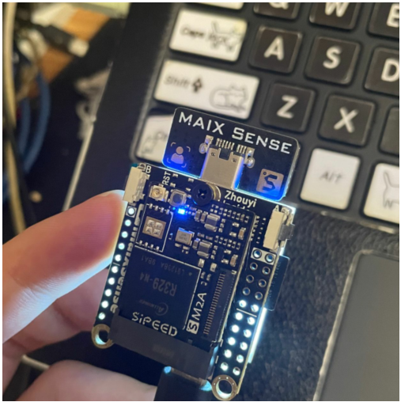

- 原参考文章写于2021年4月

## 获取仓库

```
https://github.com/sipeed/R329-Tina-jishu
git clone https://github.com/sipeed/R329-Tina-jishu
cd R329-Tina-jishu
git submodule update --init --recursive
```
整个仓库不重要的部分经过 coding 仓库加速，所以只需要关注以下这几个仓库即可。（该版本为开源 SDK 版本，加上了一些驱动配置以支持 Sipeed 的 R329 板）

https://github.com/sipeed/r329-package
https://github.com/sipeed/r329-linux-4.9
https://github.com/sipeed/r329-target

开源的只是裁剪了一些不必要的版型和暂不公开 DSP 和 NPU 的代码，其他的没有区别，正常使用就好。

- package 实际上就对应系统里的软件功能包，如一些 shell 命令或程序。
- linux-4.9 对应的 linux 内核，主要影响底层的驱动，需要移植到其他硬件时会来这里更改设备树和相关的裸机驱动即可。
- target 对应的是版型的一些配置文件和预置脚本等。
  
其他的很少改动，可以不用太关心，如 `boot` `、prebuild` 等，在等项目的主仓库拉取的过程中，来认识一下 SDK 的构成吧，等看完了就差不多可以开始进行编译了。

### SDK 结构
- 由于篇幅有点长所以仅给传送门 [点我](./sdk_struct.md)

看完后你已经有一些相关概念了，那就开始编译吧。

可以先看这两篇完成基本的安装，我直接列一下必要的库，编译与测试环境在 ubuntu20 （wsl2）建议大于 8G 内存。

连接开发板 https://r329.docs.allwinnertech.com/devboardstudy/r329evb5studyadbuart/
编译环境配置 https://r329.docs.allwinnertech.com/devboardstudy/r329evb5ubuntu/

上面两篇参考资料废话很多，如果你已经有经验了，就直接看脚本开始吧。

基础环境的安装：

> sudo apt-get -y install build-essential asciidoc binutils bzip2 gawk gettext git libncurses5-dev libz-dev patch python3 python2.7 unzip zlib1g-dev lib32gcc1 libc6-dev-i386 subversion flex uglifyjs git-core gcc-multilib p7zip p7zip-full msmtp libssl-dev texinfo libglib2.0-dev xmlto qemu-utils upx libelf-dev autoconf automake libtool autopoint device-tree-compiler g++-multilib antlr3 gperf wget curl swig rsync intltool busybox cmake


Ubuntu20 要增强一下，补一下下面两个包 libffi6 （python3 需要）。
```
wget http://mirrors.kernel.org/ubuntu/pool/main/libf/libffi/libffi6_3.2.1-8_amd64.deb
sudo apt install ./libffi6_3.2.1-8_amd64.deb
sudo apt-get install uuid-dev
```

其他的，自己丟了就找一下。

## 在 R329-Tina-jishu 下执行编译命令
编译前建议设置一下 `export FORCE_UNSAFE_CONFIGURE=1` ，第一次编译 host 的软件，会出现 set FORCE_UNSAFE_CONFIGURE=1 这个变量的提示。
```
cd R329-Tina-jishu
source build/envsetup.sh
lunch r329_evb5-tina
make -j32
pack
```
对应的意思是：source 加载编译环境，你可以得到 croot / cout 等跳转目录的功能，lunch 选择版型，确定要编译的版型。
```bash
dls@DESKTOP-XPS13:~/R329-Tina-jishu$ source build/envsetup.sh
Setup env done! Please run lunch next.
dls@DESKTOP-XPS13:~/R329-Tina-jishu$ lunch

You're building on Linux

Lunch menu... pick a combo:
     1. r329_evb5-tina
     2. r329_evb5_min-tina

Which would you like? [Default r329_evb5]: 1
============================================
TINA_BUILD_TOP=/home/dls/R329-Tina-jishu
TINA_TARGET_ARCH=aarch64
TARGET_PRODUCT=r329_evb5
TARGET_PLATFORM=r329
TARGET_BOARD=r329-evb5
TARGET_PLAN=evb5
TARGET_BUILD_VARIANT=tina
TARGET_BUILD_TYPE=release
TARGET_KERNEL_VERSION=4.9
TARGET_UBOOT=u-boot-2018
TARGET_CHIP=sun50iw11p1
============================================
dls@DESKTOP-XPS13:~/R329-Tina-jishu$
```
make 有以下常用命令:
- make menuconfig 配置软件包
- make kernel_menuconfig 配置内核包
- make clean 清理项目
- make defconfig 保存当前软件配置，主要影响 defconfig。
- mkernel 是编译内核的简写命令。
  
boot 要到目录下进行配置，具体怎么使用，就自己参考荔枝派 linux 的配置加入 arch= 即可。

make 单独编译模块的时候 make package/xxx/xxxx/compile 或 clean 即可。

make -j32 的意思是 使用 32 核并行编译，建议第一次用 -j1， V=s 意思是单核并开启日志输出。

如果想要有颜色的输出可以按照 colormake 方便看异常和过滤输出。

pack 会进行打包变成 img ，供 PhoenixSuit 等全志提供的软件进行烧录，可能需要注意的是分区大小之类的调整，当然你可以烧录一次后通过 dd 命令导出镜像，方便其他人烧写。

## 如何烧写？
可以参考 [V831 Sipeed](https://wiki.sipeed.com/hardware/zh/maixII/M2/flash.html) 的烧录。




按上图的核心板上的小按钮后通电，就会进入 fel 模式，或不插 SD 卡上电就会自动进入烧写模式（这要基于硬件设计），软件就会检测到了。

这种官方的烧录方法，在开发系统结束后就不会需要了，所以看过一次官方教程就行了 https://r329.docs.allwinnertech.com/devboardstudy/r329evb5compile 。