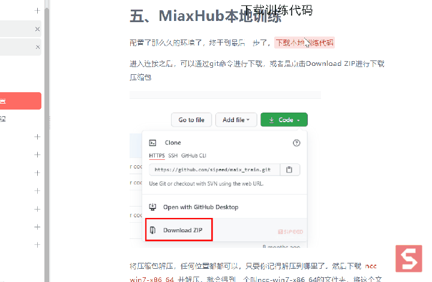

# 本地训练 for windows

> 没有任何的开发基础请慎重使用，出现问题请自行解决！

这个教程有手就行，不需要虚拟机，请严格按照教程的步骤一步步来。
tensorflow-gpu 2.3.0版本对于cuda版本有点严格，之前的教程出现了问题了，可以运行分类训练，但是对于检测训练可以训练，但是不能进行模型输出。现在已经解决了，cuda版本必须是10.1版本，cudnn是 10.1 V7.**版本，不然是不能使用GPU进行训练。

## 安装python3.8

推荐安装python3.8，由于python3.9有一些不知名问题导致了环境可能会配置失败
[点击下载安装python3.8](https://www.python.org/ftp/python/3.8.10/python-3.8.10-amd64.exe)，双击打开python3.8安装包

安装之后的python，按win+r，输入cmd打开命令行，然后输入python+回车，出现下图则表示python安装成功

## 安装pip

在python环境下安装各种包是可以通过使用pip来进行安装的，具体的安装方式[这里](https://www.cnblogs.com/littlehb/p/8886409.html)

可以通过 `pip list`来查看python上安装了的包

## CUDA和CUDNN环境配置

对于模型的训练，可以使用CPU或者是GPU进行训练，本教程是针对GPU训练的环境配置的。
不同版本的CUDA有所对应不同的显卡驱动版本要求，可以参考[这里](https://docs.nvidia.com/cuda/cuda-toolkit-release-notes/index.html)下载对应的显卡驱动版本
推荐使用CUDA10.1版本

> 必须是英伟达的显卡，如果是AMD的显卡或者电脑上没有英伟达的显卡，可以跳过这一步

### 安装显卡驱动

点击[这里](https://www.nvidia.cn/Download/index.aspx?lang=cn),选择你对应的显卡型号，下载对应的显卡驱动，然后打开文件夹，进行显卡驱动的安装。

可以通过右键的VNIDIA控制面版查看当前系统的显卡驱动版本

### 安装CUDA

打开cuda10.1下载的[链接](https://developer.nvidia.com/cuda-10.1-download-archive-base)，选择对应的系统版本和下载方式

点击Download进行下载，这个网页可能打开的比较慢，可以通过科学上网来打开。下载好的安装包，直接打开，然后一直点下一步就好了。

### 安装CUDNN

对于CUDNN下载，这个可以自行百度，由于这个网页没有科学上网的情况下打开是比较慢的。

点击[这里](https://developer.nvidia.com/rdp/cudnn-archive)进入到cudnn的下载官网，选择cudnn v7.6.5.32 for cuda 10.1的版本进行下载，

下载之后会得到一个cudnn-10.1-windows10-x64-v7.6.5.32.zip的压缩包，将其解压。解压的得到的文件三个文件，都复制到 **C:\Program Files\NVIDIA GPU Computing Toolkit\CUDA\v10.1**文件下面。

这时CUDA的环境已经配置好了

## tensorflow安装

对于tensorflow的安装，这是也是有要求的，需要安装tensorflow-gpu 2.3.0版
win+r，输入cmd，打开命令行

在命令行中输入 

    pip install tensorflow-gpu==2.3.0

如果使用这命令的时候提示 **'pip'不是内部或外部命令，也不是可运行的程序或批处理文件**，这说明了你电脑上没有安装pip，为什么不好好看我前面的写的安装pip？？？？？？？

如果下载的很慢，请输入

    pip install tensorflow-gpu==2.3.0 -i https://pypi.mirrors.ustc.edu.cn/simple

然后等待安装成功即可

## MaixHub本地训练

配置了那么久的环境了，终于到最后一步了，[下载本地训练代码](https://github.com/sipeed/maix_train)

进入连接之后，可以通过git命令进行下载，或者是点击Download ZIP进行下载压缩包

将压缩包解压，任何位置都都可以，只要你记得解压到哪里了。然后下载 [ncc-win7-x86_64](https://github.com/kendryte/nncase/releases/tag/v0.1.0-rc5) 并解压，就会得到一个叫ncc-win7-x86_64的文件夹，将这个文件夹名字修改为ncc_v0.1。

再将这个文件夹的复制到maix_train/tools/ncc文件夹下面。（如果没有ncc这个文件夹就创建一个，路径一定要对的上）

不会科学上网的同学可能会下载很慢，我已经下载好，上传到[gitee](https://gitee.com/Rui_worker/maix_train)上了(里面也有ncc的文件了)。
