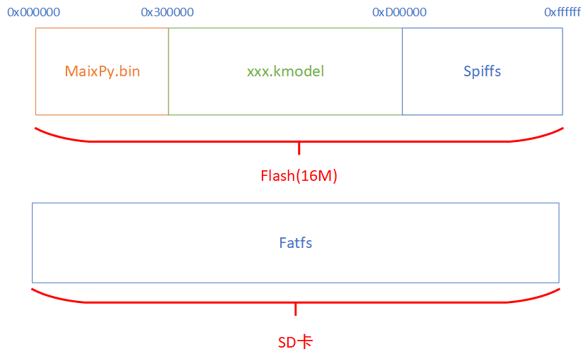

MaixPy 存储系统大致如下图所示：



由上图可知，MaixPy 中的存储介质主要由 `Flash`，`SD` 卡组成，分为三块区域，分别是 MaixPy.bin 固件区，xxx.kmodel 模型区，文件系统区：Flash 上为 [`spiffs`](https://github.com/pellepl/spiffs)（SPI Flash File System），SD 卡为 Fatfs（FAT file system）。

## MaixPy.bin 固件区

用来存储 MaixPy.bin 固件，起始于 0x000000，因为 K210 会从 0x000000 地址开始运行程序。

## xxx.kmodel 模型区

通常起始于 0x300000，模型文件之所以不烧录在 `Flash` 的文件系统（文件系统会后续解释）中，原因有下：

1. `Flash` 中文件系统拥有的内存并不够大，不足以放入大模型，更大的模型可以放入 `SD` 卡中。
2. 直接读取模型文件比经过文件系统读取速率更快。

该区域没有文件系统管理，需要根据烧录时的起始地址操作文件，例如当模型烧录在 0x500000 时的读取方法：

```python
KpuTask = kpu.load(0x500000)
```

## 文件系统区

通常从 0xD00000 开始，该区域交由文件系统管理，我们预留了 `Flash` 末尾的 `3MiB` 空间，交由 [`spiffs`](https://github.com/pellepl/spiffs) 管理， 另外也支持 `FAT32`（Fatfs） 的 `SD` 卡。这些文件系统提供接口使我们通过 **文件名** 便可对文件进行读写操作，而不必像模型区那样使用 **文件起始地址** 操作。同时还能帮助我们有效管理存储介质，例如磨损均衡（Flash 是有磨损寿命的，相关知识请自行搜索）可以充分发挥 Flash 的寿命。

### MaixPy 文件系统的使用

由于 `Flash` 和 `SD` 卡的文件系统各不相同，接口不一致，使得操作不同文件系统需要调用不同接口，此时 MaixPy 中的虚拟文件系统（VFS）正是用于解决该问题，`VFS` 可以挂载多个不同类型文件系统，并为用户操作这些文件系统提供统一接口，用户使用这些接口时可以忽略不同文件系统之间的差异。这些接口在 `os` 模块中实现，使用示例如下：

```python
import uos

print("files:", uos.listdir("/flash"))

with open("/flash/test.txt", "w") as f:
    f.write("hello text")

print("files:", uos.listdir("/flash"))

with open("/flash/test.txt", "r") as f:
    content = f.read()

print("read:", content)
```

以上示例中，`spiffs` 文件系统开机被自动挂载到 `/flash` 目录，用户只需要在使用 `os` 的接口时传入 `"/flash"` 目录名作为参数便可访问该文件系统。

解读：
* 导入 `uos` 模块
* 列出 `/flash` 目录下所有文件
* 向 `/flash` 目录写入一个名为 `test.txt` 的文件，内容为 `hello text`,
* 列出 `/flash` 目录下所有文件，会发现 `test.txt` 的存在
* 读取文件内容到 `content` 变量
* 打印 `content` 变量， 输出 `hello text`，也就是刚刚写入文件的内容
* 这个内容在开发板断电之后再上电，仍然能读到正确的内容（Flash 断电后不会丢失内容）

当然也支持 SD 卡， 如果你需要使用， SD 卡需要满足以下几点：
* 支持 `SPI` 模式,  市面上大多数正版卡都支持
* 分区为 `MBR （msdos）`
* 格式化为 `FAT32`
* 大小测试过最大 **`1TB`** 可用
断电插入 `SD` 后， 上电，`SD` 卡会被挂载在 `/sd`，如果有多个分区，第二个分区名是`/sd2`

注意`/`（根目录）不能写入数据，只能往`/flash`或者`/sd`写入数据
开机如果有`SD`卡， 会自动将当前目录切换到`/sd`， 如果没有，则会自动切换到`/flash`
