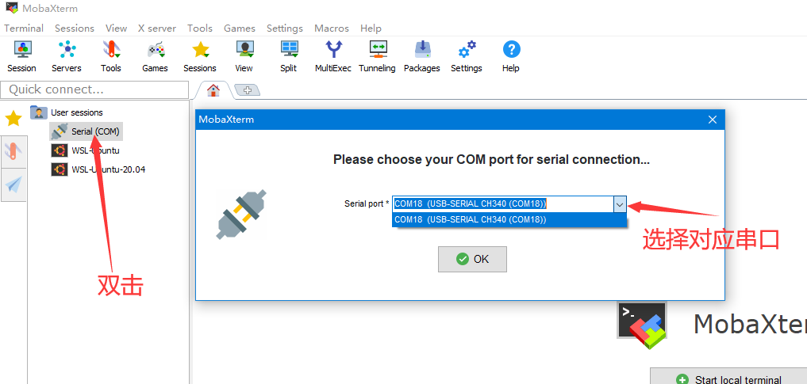

---

|     时间      | 负责人 |   更新内容   |
| :-----------: | :----: | :----------: |
| 2022年4月24日 | wonder | 增加一点细节 |
| 2022年2月28日 |  Rui   | 编写连接文档 |

> Maixsense 仅支持通过网络连接到 maixpy3

在 MaixSense 上使用 MaixPy3 ，需要烧录内置 MaixPy3 的 armbian 系统，并且连接到网络

## 设置wifi

对于新烧录的系统需要先使用串口来设置wifi连接。

其中烧录系统可以参考 [点我](./../../../../hardware/zh/maixII/M2A/flash_system.md)。系统用该选择带有maixpy3的armbian镜像。

使用 串口 连接板子，然后这里以 mobaxterm 这个软件为例


在「session setting」 对话框里选择【serial】，设置好波特率为115200，点击【OK】后就进到如下页面



> 如果提示用户名和密码的话。那么用户名和密码都是`root`。
> 注意的是输入密码的时候是没有输入显示的，因此只管输入就行。

连接板子后可以参考 [上手使用](./../../../../hardware/zh/maixII/M2A/Usages.md) 来基本用一下。

- 如果连接软件后终端界面没有任何显示，尝试按一下回车，看看有没有信息显示出来。这是因为板子已经启动完毕，串口连接迟了。

## MaixPy3 IDE 连接

### 准备

- 烧录好带有 MaixPy3 的 Armbian 系统
- 连接网络进行 MaixPy3更新，确保 MaixPy3 的版本大于 0.3.4。

在 linux 终端使用 `ifconfig` 来查看连网后的IP地址

```sh
root@maixsense:~# ifconfig            #执行ifconfig

lo: flags=73<UP,LOOPBACK,RUNNING>  mtu 65536
        inet 127.0.0.1  netmask 255.0.0.0
        inet6 ::1  prefixlen 128  scopeid 0x10<host>
        loop  txqueuelen 1000  (Local Loopback)
        RX packets 4  bytes 200 (200.0 B)
        RX errors 0  dropped 0  overruns 0  frame 0
        TX packets 4  bytes 200 (200.0 B)
        TX errors 0  dropped 0 overruns 0  carrier 0  collisions 0

wlan0: flags=4163<UP,BROADCAST,RUNNING,MULTICAST>  mtu 1500
        inet 192.168.0.2  netmask 255.255.255.0  broadcast 192.168.0.255 #这前面的 192.168.0.2 就是当前板子在网络里的IP
        inet6 fe80::6919:49c9:e927:4b62  prefixlen 64  scopeid 0x20<link>
        inet6 240e:3b7:3237:3230:34c:d8cc:2353:7812  prefixlen 64  scopeid 0x0<global>
        ether 38:01:46:2e:77:f6  txqueuelen 1000  (Ethernet)
        RX packets 5363  bytes 935435 (913.5 KiB)
        RX errors 0  dropped 896  overruns 0  frame 0
        TX packets 749  bytes 78267 (76.4 KiB)
        TX errors 0  dropped 0 overruns 0  carrier 0  collisions 0
```

从上面的 wlan0 信息里面的 `inet 192.168.0.2` 中我们可以发现本次 IP 地址是 `192.168.0.2`；
这只是一个示例，具体到每个人可能会不一样，自行更改即可

- 没有显示IP的话重新设置连接网络

### 连接

在板子终端执行下述命令来启动板子上的远程 RPyc 服务。运行完下面的命令行之后会看起来卡住了，实际上是已经在运行中了。
对于 linux 系统使用快捷键 Ctrl+C 可以来终止命令

```bash
python3 -c "import maix.mjpg;maix.mjpg.start()"
```

下面是全部的log：

```bash
Welcome to Armbian 21.08.0-trunk Bullseye with bleeding edge Linux 5.14.0-rc7-sun50iw11

No end-user support: built from trunk & unsupported (bullseye) userspace!

System load:   118%           	Up time:       3 min
Memory usage:  43% of 231M   	Zram usage:    3% of 115M   	IP:	       192.168.0.222
CPU temp:      64°C           	Usage of /:    80% of 2.9G

[ 0 security updates available, 34 updates total: apt upgrade ]
Last check: 2022-05-12 06:38

Last login: Thu May 12 07:12:30 UTC 2022 on ttyS0

root@maixsense:~# python3 -c "import maix.mjpg;maix.mjpg.start()"
Dict mode[TEST INFO] AIPU load graph successfully.
[libmaix_nn] -- start alloction tensor buffers
```

在电脑启动 MaixPy3 IDE，新建代码区，运行下面的连接代码。

- 电脑在 IDE 中新建代码区并执行

```python
$connect("192.168.0.2")   # 此处填入开发板本次的 IP 地址
import platform
print(platform.uname())
```

稍微等一会，然后运行结果如下


- 注意右上角应该是RPyc

> 启动 MaixPy3 IDE 的时候，会弹出一个 adb 终端窗口。由于我们是用网络连接且运行运行相关代码的，因此可以关闭它。

- 今后使用出现 AIPU_load_graph_helper: UMD fails in allocating buffers 错误的时候。

可以使用reboot命令重启板子或者指用下面的命令来解决（这个在修了）：
`sudo rmmod -f aipu && sudo insmod /lib/modules/5.14.0-rc7-sun50iw11/kernel/drivers/aipu/aipu.ko`

相关使用方法可以参考[使用 MaixPy3 IDE 连接 MaixII-Dock](./0.MaixII-Dock.ipynb),其中的**如何运行代码**和**首次尝试**都可以参考。

另外注意因为板子是使用无线网络连接的IDE，所以每次首次运行时需要指定IP。

### 开机自启

目前 R329 镜像是 armbian linux 系统。
用户可以自行搜索配置linux开机脚本方式来启动想要的脚本。
