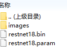

# 图像分类模型训练过程

| 时间 | 负责人 | 更新内容 | 备注 |
| --- | --- | --- | :---: |
| 2022年1月22日 | dianjixz | 编写初稿文档 | 训练教程只能在 Linux 系统中运行，<br>并只能部署到 MaixII-Dock 开发板上运行，<br>文档还需要二次整理 |

> Windows 系统暂不支持！
> 临时工程文件获取：https://github.com/dianjixz/v831_restnet18


图像分类主要采用 resnet18 网络结构，使用 Pytorch 框架进行搭建，再将经过**训练、转换和量化**后的模型文件部署到 MaixII-Dock 上。

## 准备

### 获取训练工程文件

可以在 GitHub 上下载压缩包或者是通过 git 克隆到本地

    git clone https://github.com/dianjixz/v831_restnet18

工程文件结构介绍：
```shell
├── classes_label.py                            #分类标签
├── classifier_resnet_test.py                   #测试程序
├── classifier_resnet_train.py                  #训练程序
├── convert.py                                  #模型转换程序
├── convs_data                                  #存放经过 onnx2ncnn 转换之后的模型文件
├── data                                        #训练数据文件夹
├── out                                         #训练模型输出文件夹，每隔一定训练周期输出一个模型参数
└── test                                        #测试数据集文件夹（不分类别）
```

### 数据集的制作与使用

使用手机或者 MaixII-Dock 来对物品进行拍摄，将拍摄的图片进行导出，并按照类别分类到文件夹中，文件夹名为类别的名字。图片最好是以数字进行命名，这样可以减少一些奇怪的 BUG。

> 注意！数据集中图片的分辨率需要是 224*224 ，有能力的可以自行修改源码来适配别的分辨率，我们并不提供这样的服务！

数据集 data 文件夹结构
~~~ c
── mouse
│   ├── 1.jpg
...
├── sipeed_logo
│   ├── 2.jpg
...
...
~~~

将整理好的数据集，复制到训练工程文件中的 data 文件夹下，将 classes_label.py 里面的 labels 值修改成 data 下的文件夹名字。

- 例如：data文件夹内为

则需要将 `classes_label.py` 修改成
    ```python
labels = ["mouse","sipeed_logo"]
    ```

## 训练:

训练的相关参数，在工程中的 classifier_resnet_train.py 文件里面，可以根据自己的需要进行修改，不懂怎么修改的，就保持默认就好了

~~~ python
dataset_path = "data"		#训练集的路径
val_split_from_data = 0.1 # 10%		#学习率
batch_size = 4						#训练批次
learn_rate = 0.001	                #学习率
total_epoch = 100					#训练循环，总共需要训练100个循环
eval_every_epoch = 5				#每个循环训练次数
save_every_epoch = 20				#多少个循环保存一次
dataload_num_workers = 2			
input_shape = (3, 224, 224)			#输入尺寸
cards_id = [0]					#使用的训练卡
param_save_path = './out/classifier_{}.pth'	#参数保存路径
~~~

开始训练，在 resnet18 工程文件夹目录下运行

~~~ bash
python classifier_resnet_train.py
~~~

训练完成后，会在工程目录下生成一个 out 文件夹，在 out 文件夹下存放着训练过程中保存的训练参数。

例如：
~~~ bash
.
├── classifier_99.pth             #训练过程中保存的参数
├── classifier_final.pth          #训练完成后保存的参数
└── classifier.onnx               #生成的onnx深度学习网络文件
~~~

## 测试  

准备好你的测试图片，注意和数据集中的图片尺寸一样。新建一个 test 目录，并放在该目录下。   

运行 `python classifier_resnet_test.py images_folder_path model_param_path` 命令进行测试。

在该命令中会调用用户环境中的 ncnn 工具，请确保[训练环境](./ready.md)已经搭建好了。  

模型测试并生成 ncnn 模型文件：  
~~~ bash 
python3 classifier_resnet_test.py ./test ./out/classifier_final.pth
~~~


运行完测试后，会生成 ncnn 模型和 ncnn 模型参数。
~~~
nihao@nihao:~/work/work_space/v831_restnet18/out$ ls
classifier_2.pth  classifier.bin  opt.bin
classifier_1.pth  classifier.onnx  opt.param
classifier_3.pth  classifier.param  opt.table
~~~

在线 maixhub 量化为 int8 模型才可以被使用。

## 模型转换 

生成的 ncnn 模型此时还无法被 v831 直接使用，需要使用 [MaixHub](https://maixhub.com/modelConvert) 在线模型转换工具进行量化模型，转换成 MaixII-Dock 可以直接使用的 awnn 模型
将一下内容整合到一个压缩包中：
- 创建为 images 的文件夹，内容一些较正图片，可考虑直接采用训练中的验证数据集，并务必保证矫正时图像的预处理方式与训练和部署时一致。（数量在50张左右）
- 将训练结束之后得到的模型文件一个 xxx.bin 和一个 xxx.param。
- 压缩包内文件结构如图：
    
> 注意：确保 images 目录内没有混入其他文件，否则会导致模型量化错误。

注册登录并激活账号后,上传你的压缩包等待模型转换任务完成。

## 模型部署  

等待模型转换完成,下载转换好的模型文件。将得到的 *.param 、 *.bin 和训练工程中 classes_label.py 文件上传到 MaixII-Dock 上。

将以下代码复制到开发板上即可使用

~~~ python
from maix import nn, display, camera, image
from root.classes_label import labels    #分类标签,需要替换
import time

model = {
    "param": "/root/restnet18_int8.param",        #模型文件,需要替换成自己训练的模型路劲
    "bin": "/root/restnet18_int8.bin"
}
options = {
    "model_type":  "awnn",
    "inputs": {
        "input0": (224, 224, 3)
    },
    "outputs": {
        "output0": (1, 1, len(labels))           
    },
    "first_layer_conv_no_pad": False,
    "mean": [127.5, 127.5, 127.5],
    "norm": [0.00784313725490196, 0.00784313725490196, 0.00784313725490196],
}

print("-- load model:", model)
m = nn.load(model, opt=options)
print("-- load ok")

while True:
    img = camera.capture()
    AI_img = img.copy().resize(224, 224)
    t = time.time()
    out,  = m.forward(AI_img, quantize=True)
    t = time.time() - t
    print("-- forward time: {}s".format(t))
    msg = "{}%: {}".format(int(out.max() * 10), labels[out.argmax()])
    print(msg)
    img.draw_string(0, 0, msg, color = (255, 0, 0))
    display.show(img)
~~~

运行效果：  


