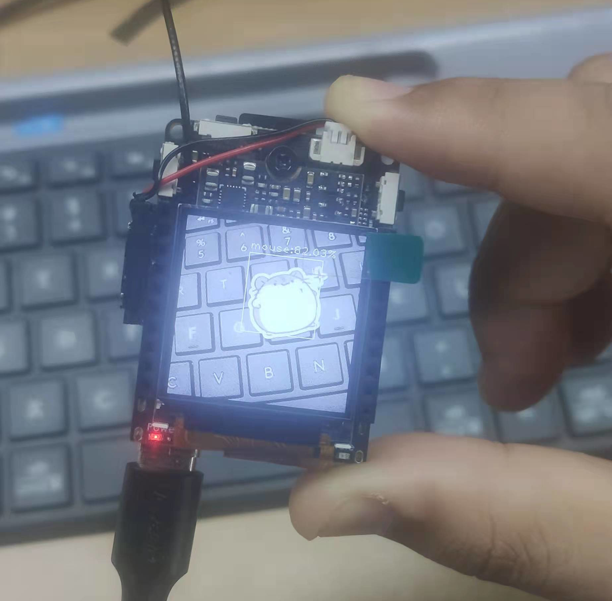

# 这是用于训练 MaixII-Dock 检测模型的仓库

| 时间 | 负责人 | 更新内容 | 备注 |
| --- | --- | --- | :---: |
| 2022年1月22日 | dianjixz | 编写初稿文档 | 训练教程只能在 Linux 系统中运行， 并只能部署到 MaixII-Dock 开发板上运行， 文档还需要二次整理 |

> Windows 系统暂不支持！
> 临时工程文件获取：https://github.com/dianjixz/v831_yolo

## 基本概念
目标检测（Object Detection）的任务是找出图像中所有感兴趣的目标（物体），确定它们的类别和位置，是计算机视觉领域的核心问题之一。由于各类物体有不同的外观、形状和姿态，加上成像时光照、遮挡等因素的干扰，目标检测一直是计算机视觉领域最具有挑战性的问题。

计算机视觉中关于图像识别有四大类任务：

（1）分类-Classification：解决“是什么？”的问题，即给定一张图片或一段视频判断里面包含什么类别的目标。

（2）定位-Location：解决“在哪里？”的问题，即定位出这个目标的的位置。

（3）检测-Detection：解决“在哪里？是什么？”的问题，即定位出这个目标的位置并且知道目标物是什么。

（4）分割-Segmentation：分为实例的分割（Instance-level）和场景分割（Scene-level），解决“每一个像素属于哪个目标物或场景”的问题。

> 了解更多可以查看 CSDN 博文：<https://blog.csdn.net/yegeli/article/details/109861867>

## 模型训练

| 网络结构 | 训练平台 | 部署平台 | 模型转换工具 |
| --- | --- | --- | -- | 
| YOLOv2 | PyTorch | MaixII-Dock | ncnn + MaixHub 在线转换工具 |
### 数据集制作与使用  

YOLOv2 默认使用 voc 格式的数据集,文件夹取名为 custom 放到 data 目录下, 比如:
~~~ bash
#voc格式的yolo训练数据集
├── custom    #数据集文件夹名
│   ├── Annotations		#标注文件
│   ├── ImageSets		#训练参数划分
│   │    └── Main
│   │         ├── train.txt
│   │         └── val.txt
│   ├── JPEGImages		#训练图片
~~~

train.txt 和 val.txt 中, 每一行是一个数据(图像)名, 路径相对于 `JPEGImages`
~~~ bash
train.txt 写着用于训练的图片名称
val.txt  写着用于验证的图片名称
~~~
**修改配置**

修改 `data/custom.py` 中的 `CUSTOM_CLASSES` 变量为正确的 `labels`
~~~ python
CUSTOM_CLASSES = [
    "mouse",
    "sipeed_logo"
]
~~~

### 训练开始

~~~ bash
python train.py -d custom --cuda -v slim_yolo_v2 -hr -ms
~~~

[//]: # "或者安装好horovod, 然后多卡训练"
[//]: # "~~~ bash"
[//]: # "horovodrun -np 4 python train.py -d custom --cuda -v slim_yolo_v2 -hr -ms"
[//]: # "~~~"

训练完成后会在 weights/custom/slim_yolo_v2 目录下生成训练中保存的参数

### 导出模型

~~~ bash
python3 test.py -d custom -v slim_yolo_v2 --trained_model weights/custom/slim_yolo_v2/slim_yolo_v2_1000.pth --visual_threshold 0.3 -size 224 --export
~~~

运行导出模型命令后会在 out 目录下生成 test 测试图片效果和模型文件,模型转换请参考上面模型转换章节.

### 模型部署  
等待模型转换完成,下载转换好的模型文件.  
得到的 *.param 和 *.bin 文件就是部署在 MaixII-Dock 上的文件.  
打开事例代码,替换模型文件名,分类标签和模型加载参数,然后运行即可. 
~~~ python
#检测示例代码

from maix import nn, camera, image, display
from maix.nn import decoder
import time

model = {
    "param": "/root/yolov2_int8.param",
    "bin": "/root/yolov2_int8.bin"
}
options = {
    "model_type":  "awnn",
    "inputs": {
        "input0": (224, 224, 3)
    },
    "outputs": {
        "output0": (7, 7, (1+4+2)*5)    #输出参数修改,修改格式 (7 ,7 , (1 + 4 + "类别数量" ) * 5)
    },
    "mean": [127.5, 127.5, 127.5],
    "norm": [0.0078125, 0.0078125, 0.0078125],
}

labels = ["mouse","sipeed_logo"]            #分类标签
anchors = [1.19, 1.98, 2.79, 4.59, 4.53, 8.92, 8.06, 5.29, 10.32, 10.65]

m = nn.load(model, opt=options)
yolo2_decoder = decoder.Yolo2(len(labels), anchors, net_in_size=(options["inputs"]["input0"][0], options["inputs"]["input0"][1]), net_out_size=(7, 7))

while True:
    img = camera.capture()
    AI_img = img.copy().resize(224, 224)
    out = m.forward(AI_img.tobytes(), quantize=True, layout="hwc")
    boxes, probs = yolo2_decoder.run(out, nms=0.3, threshold=0.3, img_size=(options["inputs"]["input0"][0], options["inputs"]["input0"][1]))

    if len(boxes):
        for i, box in enumerate(boxes):
            class_id = probs[i][0]
            prob = probs[i][1][class_id]
            disp_str = "{}:{:.2f}%".format(labels[class_id], prob*100)
            img.draw_rectangle(box[0], box[1], box[0] + box[2], box[1] + box[3], color = (255, 255, 255))
            x = box[0]
            y = box[1] - 20
            if y < 0:
                y = 0
            img.draw_string(x, y, disp_str, color = (255, 255, 255))

    display.show(img)

~~~

运行效果图:

> 参考：
>csdn 博客：https://blog.csdn.net/yegeli/article/details/109861867
